# Triple Loop クイックリファレンス — 1ページチートシート

> **このカードの使い方**: 迷ったらここを見る。詳細は各リンク先ドキュメントへ。

---

## A. ファイル配置早見表

| テンプレートファイル | コピー先 | 必須/任意 | 用途 |
|---------------------|---------|---------|------|
| `templates/CLAUDE.md` | `~/.claude/CLAUDE.md` | **必須** | Triple Loop のコアプロンプト・ループ制御ロジック |
| `templates/AGENTS.md` | `/your-project/AGENTS.md` | **必須** | プロジェクト規約・エージェント設定 |
| `templates/TASKS.md` | `/your-project/TASKS.md` | **必須** | タスクキュー・優先度管理 |
| `.github/agents/*.agent.md` | `/your-project/.github/agents/` | 推奨 | カスタムエージェント定義（5種） |
| `operations/00_フル自律開発起動(FullAutoStart).md` | 参照のみ（コピー元） | 参照用 | `/loop` コマンドの完全テンプレート |

```bash
# セットアップ最小手順（30秒）
mkdir -p ~/.claude
cp templates/CLAUDE.md ~/.claude/CLAUDE.md
cp templates/AGENTS.md /your-project/AGENTS.md
cp templates/TASKS.md  /your-project/TASKS.md
```

---

## B. 起動コマンド早見表

```bash
# ── Claude Code 起動 ──────────────────────────────────────────
cd /your-project
claude --dangerously-skip-permissions

# ── セッション内コマンド ──────────────────────────────────────

# 🔄 2サイクル 15H（推奨・週5日標準運用）
/loop 900m 以下の3重ループを2サイクル実行してください。（CLAUDE.md参照）

# 🔄 1サイクル 8H（軽量・リミット節約）
/loop 450m 以下の3重ループを1サイクルとして実行してください。（CLAUDE.md参照）

# 🔍 Monitor のみ（現状調査・コード変更なし）
/loop 30m Monitor Loop 指示に従いプロジェクトを分析。コード変更禁止。.loop-monitor-report.md に出力。

# 🔨 Build のみ（実装のみ）
/loop 120m Build Loop 指示に従いTASKS.mdから優先度順にタスクを5段階で実装。完了後 .loop-build-handoff.md に出力。

# ✅ Verify のみ（品質確認のみ）
/loop 60m Verify Loop 指示に従い品質ゲートを全実行。結果を .loop-verify-report.md に出力。

# 🚀 並列エージェント起動（/fleet）
/fleet
  Use @backend-agent でAPI実装を担当し、
  Use @test-writer でテストを並列生成し、
  Use @docs-agent でドキュメントを更新してください。

# 📊 使用量確認
/usage

# 🗜 コンテキスト圧縮（2時間ごと推奨）
/compact

# 🤖 現在のモデルとコスト確認
/model
```

---

## C. ループ状態確認（デバッグ用コマンド）

```bash
# ── 出力ファイルの確認 ─────────────────────────────────────────
cat .loop-monitor-report.md      # Monitor 分析結果
cat .loop-build-handoff.md       # Build → Verify への引き継ぎ
cat .loop-verify-report.md       # Verify 品質ゲート結果
cat .loop-alert.md               # 異常検知ログ（存在する場合のみ）

# ── Git でループ進捗を確認 ──────────────────────────────────────
git log --oneline -20             # 最近20コミット
git status                        # 未コミット変更

# ── テスト・品質状態 ───────────────────────────────────────────
npm test -- --coverage            # テスト + カバレッジ
npm run lint                      # Lint チェック
npx tsc --noEmit                  # 型チェック
npx trivy fs .                    # セキュリティスキャン

# ── ループが止まった場合の確認 ─────────────────────────────────
# 1. .loop-alert.md の内容を確認
# 2. git log で最後のコミットを確認
# 3. TASKS.md の残タスクを確認
# 4. 必要なら /loop を再実行（中断ポイントから再開）
```

---

## D. エージェント選択ガイド

| タスク種別 | 推奨エージェント | 推奨モデル | コスト倍率 |
|-----------|---------------|-----------|-----------|
| REST API 設計・実装 | `@backend-agent` | Claude Opus 4.6 | 10× |
| DB設計・マイグレーション | `@backend-agent` | Claude Opus 4.6 | 10× |
| 認証・セキュリティロジック | `@security-agent` | Claude Opus 4.6 | 10× |
| React コンポーネント実装 | `@frontend-agent` | Claude Sonnet 4.6 | 1× |
| UI スタイリング・アクセシビリティ | `@frontend-agent` | Claude Sonnet 4.6 | 1× |
| ユニットテスト・E2Eテスト生成 | `@test-writer` | GPT-5.3-Codex | 2× |
| README・API仕様書生成 | `@docs-agent` | Claude Sonnet 4.6 | 1× |
| 脆弱性スキャン・SAST | `@security-agent` | Claude Opus 4.6 | 10× |
| コメント追加・リファクタ（単純） | `@docs-agent` または直接 | Claude Haiku 4.5 | 0.25× |
| リポジトリ探索・調査 | `explore` モード | Claude Haiku 4.5 | 0.25× |

> **選択のコツ**: 複雑な判断が必要 → Opus、一般実装 → Sonnet、単純作業 → Haiku

---

## E. コスト見積もり早見表

### モデル別コスト倍率

| モデル | 倍率 | 1リクエスト目安 | 最適用途 |
|-------|------|--------------|---------|
| Claude Opus 4.6 | **10×** | 高コスト | アーキテクチャ設計・複雑なロジック（最小限に） |
| Claude Opus 4.5 | **10×** | 高コスト | 上記旧版 |
| GPT-5.3-Codex | **2×** | 中コスト | コード変換・テスト生成 |
| GPT-5.2 | **1.5×** | 中コスト | バランス型タスク |
| Claude Sonnet 4.6 | **1×** ★基準 | 標準 | 通常の実装タスク（デフォルト） |
| Claude Haiku 4.5 | **0.25×** | 低コスト | 単純処理・コメント・サブエージェント |
| GPT-5-mini | **0.1×** | 最安 | 軽量タスク・フォーマット変換 |

### 運用シミュレーション（Sonnet 4.6 基準）

| 月次上限 | 1タスク=30リクエスト | Triple Loop 15H 回数 |
|---------|-------------------|-------------------|
| 300 リクエスト | 〜10タスク処理可能 | 約5回（週1回） |
| 1,000 リクエスト | 〜33タスク処理可能 | 約16回（週3〜4回） |
| 3,000 リクエスト | 〜100タスク処理可能 | 毎日実行可能 |

### コスト削減チェック（実行前に確認）

```
□ Opus は設計・複雑ロジックのみ（乱用禁止）
□ @ファイルパス でコンテキストを事前注入した
□ /fleet のサブエージェントは 4個以内
□ 2時間ごとに /compact を実行した
□ 単純作業に Haiku を割り当てた
```

---

## F. よくあるエラー Top 5

| # | 症状 | 原因 | 対処（即実行） |
|---|------|------|-------------|
| **1** | ループが途中で停止・無反応 | コンテキスト上限超過 | `/compact` → `/loop` を再実行 |
| **2** | `TASKS.md が見つからない` エラー | ファイル未配置 | `cp templates/TASKS.md ./TASKS.md` |
| **3** | テストが通らないまま Build が終了 | Verify Gate 失敗 | `.loop-verify-report.md` を確認 → 失敗箇所を手動修正 → 再度 `/loop` |
| **4** | `Permission denied` でコマンドが止まる | `--dangerously-skip-permissions` 未指定 | `claude --dangerously-skip-permissions` で再起動 |
| **5** | コミットが一切されない | `AGENTS.md` のブランチ設定ミス | `AGENTS.md` の `branch` フィールドを確認・修正 |

> **万能対処法**: `.loop-alert.md` を読む → `git log --oneline -5` で最終進捗確認 → 問題を修正して再 `/loop`

---

## G. タスク優先度スコア式

### 計算式

```
優先度スコア = (ビジネス影響度 × 3) + (技術的緊急度 × 2) + (依存解消効果 × 1)
              ─────────────────────────────────────────────────────────────────
              (見積もり工数 × 1.5) + (リスク係数 × 1)
```

**各係数の評価基準（1〜5点）**:

| 係数 | 5点 | 3点 | 1点 |
|-----|-----|-----|-----|
| ビジネス影響度 | 収益直結・ユーザー影響大 | 機能改善 | 内部ツール改善 |
| 技術的緊急度 | 本番障害・セキュリティ穴 | バグ修正 | コード品質改善 |
| 依存解消効果 | 5タスク以上のブロック解除 | 2〜4タスク | 単独タスク |
| 見積もり工数 | 8H超（1日分） | 2〜4H | 1H以内 |
| リスク係数 | 破壊的変更・本番影響 | テスト不足 | 低リスク |

### 計算例

```
タスク: 「認証トークンのリフレッシュロジック実装」
  ビジネス影響度 = 4（ログアウト問題に直結）
  技術的緊急度  = 5（本番でセッション切れ頻発）
  依存解消効果  = 3（3タスクがブロックされている）
  見積もり工数  = 2（約3H）
  リスク係数    = 2（既存テストあり）

スコア = (4×3 + 5×2 + 3×1) / (2×1.5 + 2×1)
       = (12 + 10 + 3) / (3 + 2)
       = 25 / 5 = 5.0  ← 高優先度（上位10%）
```

---

## H. Triple Loop タイムライン

### 8H サイクル（`/loop 450m`）

```mermaid
gantt
    title 1サイクル 8H タイムライン
    dateFormat HH:mm
    axisFormat %H:%M

    section Monitor Loop
    コンテキスト収集・タスク選択   :m1, 00:00, 30m
    依存関係分析・優先度算出       :m2, after m1, 20m
    コンテキストパッケージ生成     :m3, after m2, 10m

    section Build Loop
    要件分析・設計（Step 1）       :b1, after m3, 30m
    コア実装（Step 2）             :b2, after b1, 150m
    テスト実装（Step 3）           :b3, after b2, 60m
    Lint / 型チェック修正（Step 4）:b4, after b3, 30m
    ドキュメント + Commit（Step 5）:b5, after b4, 30m

    section Verify Loop
    テストスイート実行             :v1, after b5, 20m
    カバレッジ計測                 :v2, after v1, 10m
    セキュリティスキャン           :v3, after v2, 15m
    PR 作成・品質レポート出力      :v4, after v3, 15m

    section 最終処理
    TASKS.md 更新・ログ記録        :f1, after v4, 10m
```



### 15H サイクル（`/loop 900m`）— 上記を2回繰り返し

```mermaid
gantt
    title 2サイクル 15H タイムライン（概要）
    dateFormat HH:mm
    axisFormat %H:%M

    section 第1サイクル
    Monitor（〜1H）  :c1m, 00:00, 60m
    Build（〜5H）    :c1b, after c1m, 300m
    Verify（〜1H）   :c1v, after c1b, 60m
    処理間バッファ   :c1f, after c1v, 30m

    section 第2サイクル
    Monitor（〜1H）  :c2m, after c1f, 60m
    Build（〜5H）    :c2b, after c2m, 300m
    Verify（〜1H）   :c2v, after c2b, 60m
    最終処理         :c2f, after c2v, 30m
```



---

## I. 品質ゲート一覧

各ループが「完了」と判定されるための通過条件サマリー。

### Monitor Loop 完了条件

| 条件 | 詳細 |
|------|------|
| ✅ タスク選択完了 | 優先度スコアが最高のタスクを1件選定 |
| ✅ コンテキスト収集完了 | 関連ファイル・Issue・最新コミット取得済み |
| ✅ 異常なし（または対処済み） | `.loop-alert.md` が空 or 対処方針を記載済み |
| ✅ コンテキストパッケージ出力 | Build Loop が参照できる形式で `.loop-monitor-report.md` に保存 |

### Build Loop 完了条件

| 条件 | 詳細 |
|------|------|
| ✅ 5段階ステップ完了 | 設計→実装→テスト→Lint→Docs が全完了 |
| ✅ ビルド成功 | `npm run build` / `docker build` がエラーなし |
| ✅ Lint クリーン | 新規 Lint エラーがゼロ |
| ✅ 型チェック通過 | TypeScript 型エラーがゼロ |
| ✅ コミット済み | `main` ブランチに全変更がコミット済み |
| ✅ 引き継ぎ出力 | `.loop-build-handoff.md` にコミット SHA・変更サマリー記載 |

### Verify Loop 完了条件（全ゲートが pass = マージ可能）

| ゲート | Pass 条件 | Fail 時の対応 |
|-------|----------|-------------|
| **テストスイート** | 失敗テスト数 = 0 | Build に差し戻し・エラーログ添付 |
| **カバレッジ** | 新規コードのカバレッジ ≥ 80% | 不足分のテスト追加を Build に指示 |
| **Lint / 静的解析** | 新規 violation = 0 | 違反箇所リストを Build に返却 |
| **セキュリティスキャン** | Critical/High 脆弱性 = 0 | セキュリティエージェントに修正依頼 |
| **型チェック** | TypeScript エラー = 0 | 型エラーリストを Build に返却 |
| **リグレッション** | ベースラインから劣化なし | 劣化箇所を Monitor に報告・再キュー |

---

## J. 関連ドキュメントリンク

### 🏁 はじめに
- [README.md](README.md) — プロジェクト概要・クイックスタート
- [operations/00_利用ガイド(UsageGuide).md](operations/00_利用ガイド(UsageGuide).md) — 2ファイル構成の説明・起動方法3種
- [operations/copilot-start-guide.md](operations/copilot-start-guide.md) — CLAUDE.md 配置から放置まで

### ⚙️ 起動・コマンド
- [operations/00_フル自律開発起動(FullAutoStart).md](operations/00_フル自律開発起動(FullAutoStart).md) — `/loop` コマンドのコピペ元（完全版）
- [operations/loop-command-usage.md](operations/loop-command-usage.md) — `/loop` コマンド完全リファレンス
- [operations/autonomous-development-workflow.md](operations/autonomous-development-workflow.md) — タスク準備 → Monitor → Build → Verify → 最終処理

### 🔄 ループ詳細
- [loops/monitor-loop.md](loops/monitor-loop.md) — Monitor Loop の実行フロー・コンテキスト収集
- [loops/build-loop.md](loops/build-loop.md) — Build Loop の5段階ステップ・リトライロジック
- [loops/verify-loop.md](loops/verify-loop.md) — Verify Loop の品質ゲート・テスト・セキュリティ

### 💰 コスト・最適化
- [operations/cost-optimization-guide.md](operations/cost-optimization-guide.md) — プレミアムリクエスト管理・コスト最適化5パターン

### 🤝 チーム運用
- [operations/team-onboarding-guide.md](operations/team-onboarding-guide.md) — 30分クイックスタート・組織設定・チーム運用フロー

### 🏗 アーキテクチャ
- [architecture/triple-loop-architecture.md](architecture/triple-loop-architecture.md) — Triple Loop の全体設計・状態機械
- [architecture/agent-teams-system.md](architecture/agent-teams-system.md) — 8つの Agent チームの役割

### 📘 実例・サンプル
- [examples/example-end-to-end-workflow.md](examples/example-end-to-end-workflow.md) — 5タスクの一夜セッション全記録
- [examples/example-fleet-execution.md](examples/example-fleet-execution.md) — `/fleet` 並列実行ウォークスルー
- [examples/example-failure-recovery.md](examples/example-failure-recovery.md) — 失敗時リカバリー手順集（7パターン）
- [examples/real-world-project-example.md](examples/real-world-project-example.md) — SaaS プロジェクト実践例（本ドキュメント）

### 📁 テンプレート
- [templates/AGENTS.md](templates/AGENTS.md) — プロジェクトルートにコピーして使う
- [templates/TASKS.md](templates/TASKS.md) — タスク管理・優先度キュー
- [templates/CLAUDE.md](templates/CLAUDE.md) — Claude/Copilot 起動時の詳細設定

---

> **最終更新**: このファイルを最新に保つには `CHANGELOG.md` を参照してください。
> **バグ報告・改善提案**: Issue を立てるか `TASKS.md` に追記してください。
