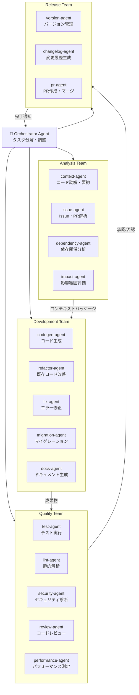
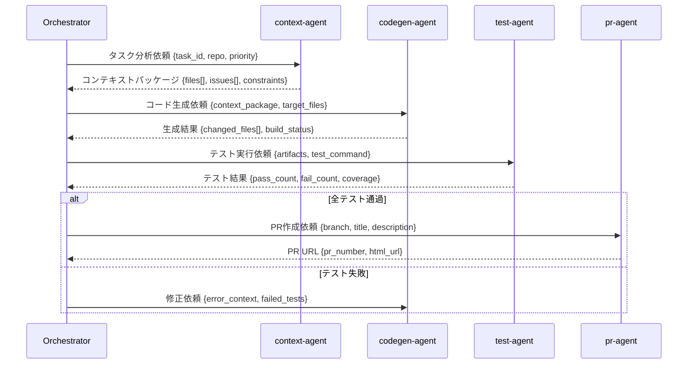
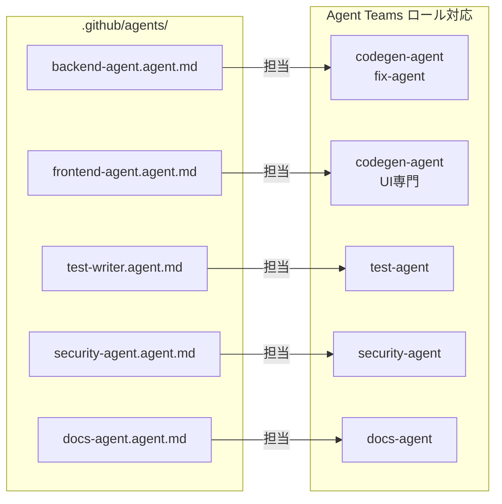

# Agent Teams System

## Overview

The Agent Teams System organizes individual Copilot agents into specialized teams, each responsible for a specific area of the development lifecycle. Rather than using a single general-purpose agent for all tasks, this system assigns narrowly scoped agents to roles — improving focus, reliability, and the ability to optimize prompts for each domain.

---

## Team Structure

```
┌─────────────────────────────────────────────────────────────────┐
│                       Orchestrator Agent                        │
│        (coordinates all teams; owned by Task Dispatcher)        │
└──────────────────────────┬──────────────────────────────────────┘
                           │
       ┌───────────────────┼───────────────────┐
       │                   │                   │
       ▼                   ▼                   ▼
┌─────────────┐   ┌─────────────────┐   ┌─────────────────┐
│  Analysis   │   │  Development    │   │    Quality      │
│    Team     │   │     Team        │   │    Team         │
└─────────────┘   └─────────────────┘   └─────────────────┘
```

---

## Teams and Roles

### Orchestrator Agent

The master coordinator. Receives high-level task descriptions and decomposes them into subtasks assigned to each team. Monitors overall progress and handles cross-team dependencies.

**Responsibilities:**
- Task decomposition and prioritization
- Dependency resolution between subtasks
- Progress monitoring and escalation
- Final integration and handoff decisions

---

### Analysis Team

Responsible for understanding what needs to be built or fixed before any code is written.

| Agent          | Role                                                          |
|----------------|---------------------------------------------------------------|
| `context-agent`  | Reads and summarizes relevant code files and documentation  |
| `issue-agent`    | Parses GitHub Issues, PRs, and comments for requirements    |
| `dependency-agent` | Analyzes package dependencies and version constraints    |
| `impact-agent`   | Identifies which parts of the codebase may be affected      |

**Output:** A structured context package (JSON/YAML) passed to the Development Team.

---

### Development Team

Responsible for writing and modifying code to implement the required changes.

| Agent              | Role                                                      |
|--------------------|-----------------------------------------------------------|
| `codegen-agent`    | Generates new source code based on context packages       |
| `refactor-agent`   | Modifies existing code while preserving behavior          |
| `fix-agent`        | Diagnoses and repairs build errors and failed tests       |
| `migration-agent`  | Handles schema migrations, API version upgrades, etc.     |
| `docs-agent`       | Generates or updates inline documentation and READMEs     |

**Output:** Modified or created source files committed to a feature branch.

---

### Quality Team

Responsible for validating that the code produced by the Development Team is correct, safe, and maintainable.

| Agent              | Role                                                       |
|--------------------|------------------------------------------------------------|
| `test-agent`       | Runs the test suite and reports pass/fail/coverage         |
| `lint-agent`       | Runs static analysis and code style checks                 |
| `security-agent`   | Scans for vulnerabilities, secrets, and insecure patterns  |
| `review-agent`     | Performs AI-driven code review, flags design issues        |
| `perf-agent`       | Runs performance benchmarks and flags regressions          |

**Output:** Quality report submitted to the Verify Loop; regressions fed back to Development Team.

---

## Agent Communication Protocol

Agents communicate through structured JSON messages on the Feedback Bus:

```json
{
  "sender": "codegen-agent",
  "receiver": "fix-agent",
  "task_id": "TASK-1042",
  "type": "error_report",
  "payload": {
    "file": "src/auth/token.ts",
    "line": 47,
    "error": "Property 'expiresIn' does not exist on type 'JwtOptions'",
    "build_log": "...(truncated)..."
  },
  "timestamp": "2024-01-15T10:30:00Z"
}
```

**Message types:**

| Type              | Direction           | Description                                  |
|-------------------|---------------------|----------------------------------------------|
| `task_assignment` | Orchestrator → Team | Assign a new subtask to a team               |
| `context_package` | Analysis → Dev      | Deliver gathered context for code generation |
| `error_report`    | Build → Fix         | Report a build or runtime error              |
| `quality_report`  | Quality → Monitor   | Deliver test/lint/security results           |
| `escalation`      | Any → Human         | Request human review or decision             |
| `status_update`   | Any → Orchestrator  | Report progress on current subtask           |

---

## Team Coordination Patterns

### Sequential Pattern

Used for well-defined tasks with clear dependencies:

```
Analysis → Development → Quality → (merge or retry)
```

### Parallel Pattern

Used when multiple independent subtasks can proceed simultaneously:

```
Analysis ──┬── Development (feature A) ──┬── Quality
           └── Development (feature B) ──┘
```

### Iterative Pattern

Used when quality gates fail and the development team must rework:

```
Development → Quality → [fail] → Development (retry with error context)
                      → [pass] → Merge
```

---

## Scaling the Team

For large codebases or high task throughput, additional agent instances can be spawned horizontally:

- Multiple `codegen-agent` instances working on different modules in parallel
- Dedicated `fix-agent` per failing test suite
- Separate `security-agent` running on every PR regardless of other loops

All agent instances share the same State Manager and Artifact Store to prevent duplication and enable coordination.

---

## Mermaid 図: Agent Teams 全体構造



## Mermaid 図: Agent 間メッセージフロー



## Mermaid 図: カスタムエージェント対応マップ



---

## Related Documents

- [Autonomous Development Architecture](autonomous-development-architecture.md)
- [Triple Loop Architecture](triple-loop-architecture.md)
- [Autonomous Development Workflow](../operations/autonomous-development-workflow.md)
