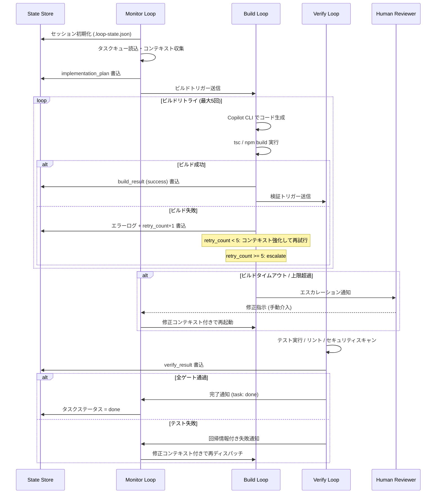

# Autonomous Development Architecture

## Overview

The Autonomous Development Architecture defines how GitHub Copilot CLI is used as the backbone of a fully automated software development pipeline. Rather than serving as a simple code-completion tool, Copilot is orchestrated as an active development agent capable of executing complete development cycles with minimal human intervention.

This architecture separates concerns across three primary dimensions:

1. **Perception** – understanding the current state of the codebase and task backlog
2. **Action** – writing code, running builds, and executing tests
3. **Verification** – validating correctness, performance, and compliance

---

## System Components

### 1. Copilot CLI Agent

The core execution engine. Copilot CLI receives structured prompts and returns code, explanations, or shell commands. In autonomous mode, it is invoked repeatedly within loops until a task reaches a defined completion state.

**Key capabilities:**
- Natural language to code translation
- Context-aware code generation using repository history
- Inline error diagnosis and auto-correction
- Shell command generation and execution planning

### 2. Task Dispatcher

A lightweight orchestrator that reads from the task queue (e.g., GitHub Issues, a JSON manifest, or a YAML task file) and dispatches individual tasks to the appropriate agent loop.

```
Task Queue → Task Dispatcher → [Monitor Loop | Build Loop | Verify Loop]
```

### 3. State Manager

Maintains the current state of each task, tracking:
- Task status (`pending`, `in_progress`, `blocked`, `complete`, `failed`)
- Loop iteration counts
- Artifact paths (generated code, test reports, logs)
- Error history for retry logic

### 4. Artifact Store

A versioned store (typically the repository itself combined with CI artifact storage) that holds:
- Generated source code
- Build outputs
- Test reports
- Coverage data
- Agent decision logs

### 5. Feedback Bus

A lightweight pub/sub or file-based messaging channel that allows loops to signal each other. For example, the Build Loop can notify the Monitor Loop when a build fails so the Monitor can re-queue additional context gathering.

---

## High-Level Data Flow

```
┌─────────────────────────────────────────────────────────┐
│                     Task Queue                          │
│         (GitHub Issues / YAML manifest)                 │
└───────────────────┬─────────────────────────────────────┘
                    │ dispatch
                    ▼
┌─────────────────────────────────────────────────────────┐
│                  Task Dispatcher                        │
└──────┬──────────────────┬──────────────────┬────────────┘
       │                  │                  │
       ▼                  ▼                  ▼
┌──────────────┐  ┌──────────────┐  ┌──────────────┐
│ Monitor Loop │  │  Build Loop  │  │ Verify Loop  │
│ (observe &   │  │  (generate & │  │ (test &      │
│  plan)       │  │   build)     │  │  validate)   │
└──────┬───────┘  └──────┬───────┘  └──────┬───────┘
       │                 │                  │
       └─────────────────┴──────────────────┘
                         │
                         ▼
              ┌──────────────────┐
              │  State Manager   │
              │  Artifact Store  │
              └──────────────────┘
```

---

## Agent Execution Model

Each agent loop follows a **Sense → Plan → Act → Evaluate** cycle:

| Phase    | Description                                                        |
|----------|--------------------------------------------------------------------|
| Sense    | Read task definition, codebase context, and previous outputs       |
| Plan     | Generate a structured prompt for Copilot describing the next step  |
| Act      | Execute Copilot's response (write files, run commands, call APIs)  |
| Evaluate | Check exit codes, test results, or output assertions; decide next  |

If Evaluate determines the step is incomplete or failed, the loop increments its retry counter and re-enters the Sense phase with enriched context (e.g., the error message from the previous attempt).

---

## Termination Conditions

Each task terminates under one of the following conditions:

| Condition     | Trigger                                                  |
|---------------|----------------------------------------------------------|
| `success`     | All assertions pass, all required artifacts produced     |
| `max_retries` | Loop retry limit exceeded (default: 5)                   |
| `timeout`     | Wall-clock limit reached (default: 30 minutes per task)  |
| `blocked`     | Loop detects a prerequisite task that is not yet complete|
| `human_required` | Loop cannot make progress without human input        |

---

## Security and Safety Boundaries

Autonomous agents operate within strict boundaries:

- **No destructive operations** without explicit confirmation flags
- **Read-only access** to production environments
- **Sandboxed build environments** (Docker containers per build)
- **Audit log** of every Copilot prompt and response
- **Human approval gates** for merging to protected branches

---

## State Manager — JSON スキーマ仕様

ループ間の状態共有に使用する `.loop-state.json` の完全スキーマ:

```json
{
  "session_id": "uuid-v4",
  "created_at": "2026-03-17T10:00:00Z",
  "updated_at": "2026-03-17T14:30:00Z",
  "loops": {
    "monitor": {
      "status": "completed",
      "started_at": "2026-03-17T10:00:00Z",
      "completed_at": "2026-03-17T10:28:00Z",
      "artifacts": ["context_package.json", "task_plan.md"],
      "retry_count": 0
    },
    "build": {
      "status": "in_progress",
      "started_at": "2026-03-17T10:30:00Z",
      "completed_at": null,
      "artifacts": [],
      "retry_count": 2,
      "last_error": "TypeScript compile error: TS2345 at src/auth.ts:42"
    },
    "verify": {
      "status": "pending",
      "started_at": null,
      "completed_at": null,
      "artifacts": [],
      "retry_count": 0
    }
  },
  "context": {
    "task_id": "TASK-1042",
    "title": "JWT expiry refresh logic",
    "priority": "high",
    "size_bytes": 18432,
    "compression_ratio": 0.72,
    "token_count": 4200
  },
  "quality_gates": {
    "coverage_threshold": 80,
    "security_scan": true,
    "lint": true
  },
  "errors": [
    {
      "timestamp": "2026-03-17T11:15:00Z",
      "loop": "build",
      "attempt": 2,
      "message": "TS2345: Argument of type 'string' is not assignable to parameter of type 'number'"
    }
  ]
}
```

---

## Feedback Bus — メッセージプロトコル仕様

### Monitor → Build メッセージ

```json
{
  "type": "implementation_plan",
  "task_id": "TASK-1042",
  "timestamp": "2026-03-17T10:28:00Z",
  "context_files": [
    { "path": "src/auth/jwt.ts", "reason": "primary target" },
    { "path": "src/auth/types.ts", "reason": "type definitions" }
  ],
  "changes_required": [
    "Add refreshToken() method to JwtService class",
    "Implement 5-minute pre-expiry detection logic"
  ],
  "constraints": ["Must not break existing auth flow", "Token must be stored in httpOnly cookie"],
  "related_issues": ["#42", "#57"]
}
```

### Build → Verify メッセージ

```json
{
  "type": "build_result",
  "task_id": "TASK-1042",
  "timestamp": "2026-03-17T12:10:00Z",
  "status": "success",
  "changed_files": [
    { "path": "src/auth/jwt.ts", "lines_added": 45, "lines_removed": 3 },
    { "path": "tests/auth/jwt.test.ts", "lines_added": 78, "lines_removed": 0 }
  ],
  "build_log": "tsc --noEmit: 0 errors\nnpm run lint: 0 warnings",
  "artifacts_path": ".artifacts/TASK-1042/"
}
```

### Verify → Monitor メッセージ

```json
{
  "type": "verify_result",
  "task_id": "TASK-1042",
  "timestamp": "2026-03-17T13:05:00Z",
  "overall": "pass",
  "test_results": { "total": 84, "passed": 84, "failed": 0, "skipped": 2 },
  "coverage": { "statements": 87.3, "branches": 82.1, "functions": 91.2 },
  "security": { "vulnerabilities": 0, "warnings": 1 },
  "regressions": [],
  "pr_url": "https://github.com/org/repo/pull/137"
}
```

---

## Mermaid 図: 完全シーケンス（エラーリトライ含む）



---

## Related Documents

- [Triple Loop Architecture](triple-loop-architecture.md)
- [Agent Teams System](agent-teams-system.md)
- [ClaudeOS Loop Specification](claudeos-loop-spec.md)
- [Autonomous Development Workflow](../operations/autonomous-development-workflow.md)
