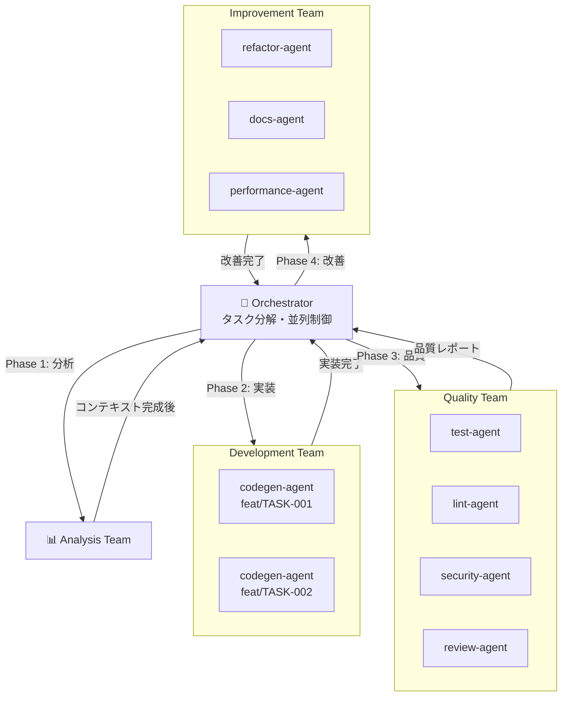
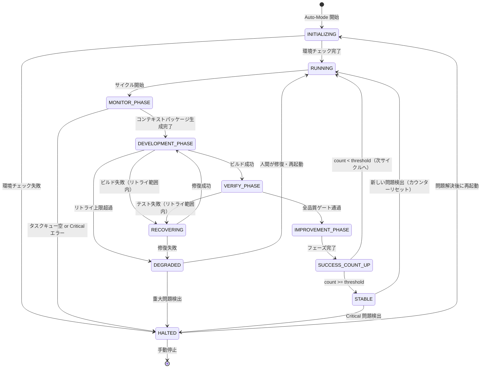
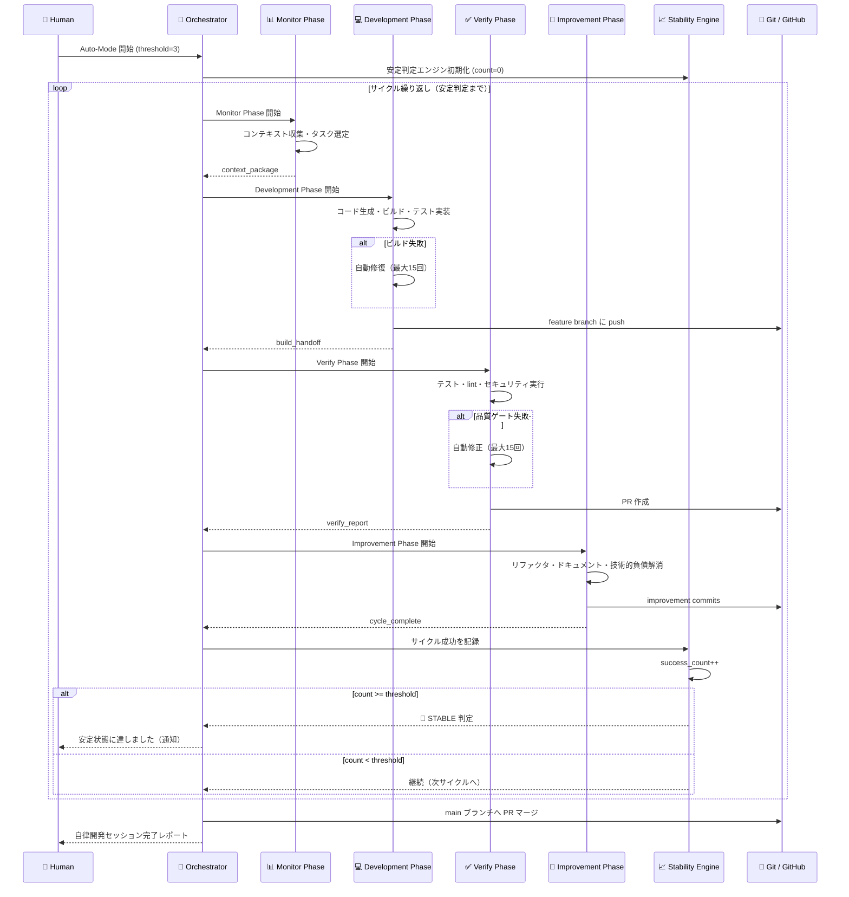
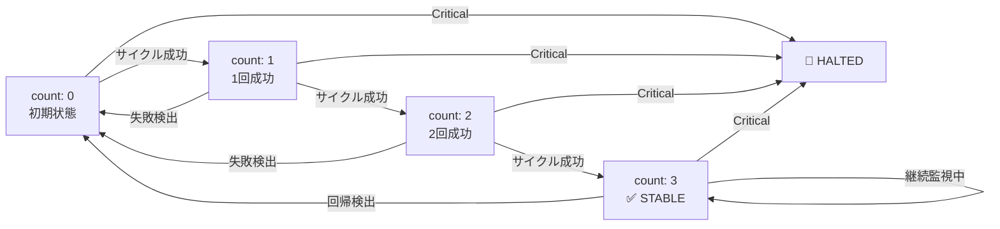

# ClaudeOS Auto-Mode Loop 仕様書

## 概要

ClaudeOS Auto-Mode Loop は、Claude が完全自律でソフトウェア開発サイクルを継続実行するための
ループ制御仕様です。**「連続N回成功 → 安定判定」** の原則に基づき、ループが安定動作している
間は人間の介入なしに開発・改善サイクルを繰り返します。

| 項目 | 値 |
|------|---|
| 最小ループサイクル | 8.5時間（Monitor: 30m + Development: 2h + Verify: 2h + Improvement: 4h） |
| 安定判定閾値（デフォルト） | 連続3回成功 |
| 最大自律実行時間 | 72時間（設定で変更可） |
| 中断トリガー | Critical エラー / セキュリティ問題 / 手動割り込み |

---

## アーキテクチャ全体像

```
┌────────────────────────────────────────────────────────────────────────┐
│                       ClaudeOS Auto-Mode Loop                          │
│                                                                        │
│  ┌─────────────┐   ┌──────────────────┐   ┌───────────────┐           │
│  │   Monitor   │──▶│   Development    │──▶│    Verify     │           │
│  │   Phase     │   │     Phase        │   │    Phase      │           │
│  │   (30 min)  │   │    (2 hours)     │   │   (2 hours)   │           │
│  └──────┬──────┘   └──────────────────┘   └───────┬───────┘           │
│         │                                          │                   │
│         │                                          ▼                   │
│         │                               ┌───────────────────┐         │
│         │                               │  Improvement      │         │
│         │                               │    Phase          │         │
│         │                               │   (4 hours)       │         │
│         │                               └────────┬──────────┘         │
│         │                                        │                    │
│         │◀───────────────────────────────────────┘                    │
│         │              (次のサイクルへ)                                │
│         ▼                                                              │
│  ┌──────────────┐                                                      │
│  │ 安定判定     │  連続N回成功 → Stable State                         │
│  │ エンジン     │  失敗検出   → カウンターリセット + 修復モード        │
│  └──────────────┘                                                      │
└────────────────────────────────────────────────────────────────────────┘
```

---

## ループ構成

### フェーズタイムライン

```
時刻   0:00                                                        8:30
       │──────────────────────────────────────────────────────────│
       │                                                           │
  0:00 ├──── Monitor Phase (30分) ─────────────────────────────────┤
       │     コンテキスト収集・タスク優先付け・コンテキストパッケージ生成   │
       │                                                           │
  0:30 ├──── Development Phase (2時間) ─────────────────────────────┤
       │     コード生成・ビルド・エラー修正・コミット                   │
       │     └── Agent Teams: Analysis → Development              │
       │                                                           │
  2:30 ├──── Verify Phase (2時間) ──────────────────────────────────┤
       │     テスト・lint・セキュリティ・カバレッジ・PR作成             │
       │     └── Agent Teams: Quality Team                        │
       │                                                           │
  4:30 ├──── Improvement Phase (4時間) ─────────────────────────────┤
       │     リファクタリング・ドキュメント・技術的負債解消              │
       │     └── Agent Teams: 並列実行（最大3エージェント）           │
       │                                                           │
  8:30 └──── サイクル完了 → 安定判定 → 次サイクル開始 ──────────────┘
```

### 各フェーズの時間配分（カスタマイズ例）

| モード | Monitor | Development | Verify | Improvement | 合計 |
|--------|---------|-------------|--------|-------------|------|
| 標準（デフォルト） | 30m | 2h | 2h | 4h | 8.5h |
| 高速サイクル | 15m | 1h | 1h | 2h | 4.25h |
| 品質重視 | 30m | 2h | 4h | 4h | 10.5h |
| 大規模タスク | 30m | 4h | 2h | 2h | 8.5h |

---

## 安定判定ロジック

### 概要

Auto-Mode Loop は **成功カウンター** を内部で管理します。
サイクルが成功するたびにカウンターが加算され、設定した閾値 N に達すると
**Stable State（安定状態）** と判定します。失敗が検出されるとカウンターは
即座にリセットされ、修復モードに移行します。

### 状態遷移

```
初期状態
  │
  ▼
[INITIALIZING]
  │ Monitor Phase 完了
  ▼
[RUNNING]  ─────────────────────────────────────────────────────────────┐
  │                                                                     │
  │ サイクル成功                                                        │
  ▼                                                                     │
[SUCCESS_COUNT++]                                                       │
  │                                                                     │
  ├── count < N ──▶ [RUNNING]（次サイクルへ）                          │
  │                                                                     │
  └── count >= N ──▶ [STABLE]（安定状態宣言・通知送信）                │
                         │                                              │
                         │ 新しい問題検出                               │
                         ▼                                              │
                     [RUNNING]（カウンターリセット）                    │
                                                                        │
  ◀──────────────── 失敗検出 ──────────────────────────────────────────┘
  │
  ├── 軽度失敗 ──▶ [RECOVERING]（自動修復・リトライ）──▶ [RUNNING]
  │
  ├── 重度失敗 ──▶ [DEGRADED]（修復試行・カウンターリセット）
  │
  └── Critical ──▶ [HALTED]（強制停止・人間エスカレーション）
```

### 成功カウンターの詳細仕様

```yaml
# 安定判定の計算ロジック
stability:
  # 連続成功回数の閾値（この回数連続で全フェーズ成功した場合に安定と判定）
  success_threshold: 3

  # 成功とみなす条件（すべて満たす必要がある）
  success_criteria:
    - all_tests_pass: true          # 全テストがパス
    - coverage_above_threshold: true # カバレッジが閾値以上
    - no_high_severity_vulns: true   # High/Critical 脆弱性なし
    - build_success: true            # ビルドが成功
    - lint_clean: true               # lint エラーが0件

  # カウンターリセット条件（いずれか1つでもリセット）
  reset_conditions:
    - any_test_failure: true         # テスト失敗（1件でも）
    - build_failure: true            # ビルド失敗
    - security_high_found: true      # High 以上の脆弱性発見
    - coverage_dropped: true         # カバレッジが前回より 5% 以上低下
    - escalation_triggered: true     # エスカレーションが発生

  # 安定状態から非安定状態へ遷移する条件
  destabilize_conditions:
    - new_test_failure: true
    - regression_detected: true
    - security_alert: true
```

### 安定判定の状態ファイル

```json
// .loop-stability-state.json（ループが自動管理）
{
  "current_state": "RUNNING",
  "success_count": 2,
  "stability_threshold": 3,
  "last_success_at": "2025-01-15T14:30:00Z",
  "last_failure_at": null,
  "total_cycles": 5,
  "total_successes": 2,
  "total_failures": 3,
  "stable_since": null,
  "reset_history": [
    {
      "reset_at": "2025-01-15T10:00:00Z",
      "reason": "test_failure",
      "detail": "src/auth/token.test.ts: 2 tests failed"
    }
  ]
}
```

---

## フェーズ詳細仕様

### Phase 1: Monitor Phase（30分）

#### 入力

| 入力 | 説明 | 必須 |
|------|------|------|
| `TASKS.md` | 実行対象タスクリスト | ✅ 必須 |
| `AGENTS.md` | 設計判断・プロジェクト方針 | 推奨 |
| `git log` | 直近コミット履歴 | 自動取得 |
| `.loop-verify-report.md` | 前サイクルの検証結果 | 前サイクル存在時 |
| `.loop-stability-state.json` | 安定判定の現在状態 | 自動管理 |

#### 処理

```
1. リポジトリ状態の解析
   ├─ git log --oneline -20 で最新コミットを確認
   ├─ git diff HEAD~1 で変更ファイルを特定
   └─ テスト・lint エラーの有無を確認

2. タスク優先度決定
   ├─ TASKS.md から [ ] 未完了タスクを取得
   ├─ 前サイクルの失敗情報を加味して優先度を再計算
   ├─ 依存関係を解析して実行可能なタスクを選定
   └─ 最大3タスクを次フェーズ向けに選定

3. コンテキストパッケージ生成
   ├─ 選定タスクに関連するファイルを最大20件収集
   ├─ 設計制約・AGENTS.md の方針をまとめる
   ├─ 前サイクルの失敗情報（ある場合）を付与
   └─ .loop-monitor-report.md に出力

4. 安定判定状態の更新
   └─ .loop-stability-state.json を更新
```

#### 出力

```
.loop-monitor-report.md
  ├─ selected_tasks: []     # 今サイクルで実施するタスク
  ├─ context_files: []      # 収集した関連ファイル
  ├─ constraints: {}        # 設計制約・方針
  ├─ previous_failures: []  # 前サイクルの失敗情報
  └─ estimated_complexity: "medium"  # 複雑度見積もり
```

#### 成功条件

- `.loop-monitor-report.md` が生成される
- `selected_tasks` に 1件以上のタスクが含まれる
- `context_files` に 1件以上のファイルが含まれる

---

### Phase 2: Development Phase（2時間）

#### 入力

| 入力 | 説明 |
|------|------|
| `.loop-monitor-report.md` | Monitor Phase の出力 |
| `context_files[]` | 関連ソースファイル群 |
| `previous_error_context` | 前回ビルド失敗情報（リトライ時） |

#### 処理

```
Step 1: 要件分析・設計（15分）
  ├─ selected_tasks の詳細を解析
  ├─ 関連ファイルの現状実装を確認
  ├─ 実装方針を AGENTS.md に追記
  └─ コミット: なし（設計フェーズ）

Step 2: コア実装（45分）
  ├─ codegen-agent がコードを生成
  ├─ 既存パターンに従った実装
  ├─ 型安全性・エラーハンドリングを考慮
  └─ コミット: feat: [タスク名] の実装

Step 3: テスト実装（30分）
  ├─ ユニットテスト / 統合テストを作成
  ├─ カバレッジ 80% 以上を目標
  └─ コミット: test: [タスク名] のテストを追加

Step 4: 品質修正（15分）
  ├─ ESLint / tsc のエラーをすべて修正
  ├─ コードフォーマット適用 (prettier)
  └─ コミット: fix: lint / typecheck エラーを修正

Step 5: ドキュメント更新（15分）
  ├─ JSDoc / docstring を追加
  ├─ README / API ドキュメントを更新
  └─ コミット: docs: [タスク名] のドキュメントを追加
```

#### 自動修復ループ

```
ビルド失敗検出
  └─ fix-agent が原因分析
  └─ 修正パッチを生成・適用
  └─ 再ビルド実行
  └─ 成功 → Step 継続
  └─ 失敗（15回超過） → Development Phase 失敗として記録
```

#### 出力

```
.loop-build-handoff.md
  ├─ status: "success" | "failed"
  ├─ completed_tasks: []    # 完了したタスク
  ├─ commits: []            # 作成したコミット
  ├─ changed_files: []      # 変更したファイル
  ├─ build_retries: 0       # ビルドリトライ回数
  └─ notes: ""              # Verify Loop 向けの申し送り
```

#### 成功条件

- `npm run build`（または相当コマンド）が exit code 0
- `status: "success"` が `.loop-build-handoff.md` に記録される
- 少なくとも 1件のコミットが作成されている

---

### Phase 3: Verify Phase（2時間）

#### 入力

| 入力 | 説明 |
|------|------|
| `.loop-build-handoff.md` | Development Phase の出力 |
| `test_command` | テスト実行コマンド（設定から） |
| `quality_gates` | 品質基準の設定 |

#### 処理

```
検証項目                ツール例              合格基準
──────────────────────────────────────────────────────
コードレビュー          review-agent          Critical/High 0件
ユニットテスト          Jest / Vitest         全件パス
統合テスト              Supertest / httpx     全件パス
ライン カバレッジ       coverage              ≥ 80%
ブランチ カバレッジ     coverage              ≥ 70%
lint                    ESLint / flake8       エラー 0件
型チェック              tsc / mypy            エラー 0件
セキュリティスキャン    npm audit / Semgrep   High 0件
依存関係チェック        npm audit             Critical 0件
```

#### 自動修正フロー

```
検証失敗
  ├─ 問題の分析（fix-agent / codegen-agent が担当）
  ├─ 修正パッチを生成
  ├─ 再検証（最大 15 回）
  │   ├─ 成功 → PR 作成準備へ
  │   └─ 15回で解決不可 → TASKS.md に記録 + エスカレーション
  └─ エスカレーション時は .loop-alert.md に詳細を記録
```

#### 出力

```
.loop-verify-report.md
  ├─ overall_status: "passed" | "failed"
  ├─ test_results:
  │   ├─ total: 120
  │   ├─ passed: 120
  │   ├─ failed: 0
  │   └─ skipped: 3
  ├─ coverage:
  │   ├─ lines: 82.5
  │   └─ branches: 71.3
  ├─ security:
  │   ├─ critical: 0
  │   └─ high: 0
  ├─ lint_errors: 0
  ├─ type_errors: 0
  ├─ pr_url: "https://github.com/..."
  └─ auto_fix_retries: 2
```

#### 成功条件

- `overall_status: "passed"` が記録される
- すべての品質ゲートが `合格基準` を満たしている
- PR が作成されている（または既存 PR に push されている）

---

### Phase 4: Improvement Phase（4時間）

#### 入力

| 入力 | 説明 |
|------|------|
| `.loop-verify-report.md` | Verify Phase の出力 |
| `AGENTS.md` | 蓄積された設計判断 |
| `git log` | コミット履歴全体 |
| `.loop-stability-state.json` | 現在の安定状態 |

#### 処理

```
Part 1: 技術的負債の解消（1時間）
  ├─ TODO コメントを収集してタスク化
  ├─ 複雑度の高い関数をリファクタリング
  ├─ 重複コードの抽出・共通化
  └─ コミット: refactor: [対象] をリファクタリング

Part 2: ドキュメントの拡充（1時間）
  ├─ 未ドキュメントの関数に JSDoc を追加
  ├─ README のクイックスタートを最新化
  ├─ AGENTS.md に新しい設計判断を追記
  └─ コミット: docs: ドキュメントを拡充

Part 3: パフォーマンス改善（1時間）
  ├─ プロファイリングで ボトルネックを特定
  ├─ N+1 クエリ・非効率なループを修正
  ├─ キャッシュ戦略の検討・実装
  └─ コミット: perf: [対象] のパフォーマンスを改善

Part 4: 次サイクル準備（1時間）
  ├─ TASKS.md の完了タスクを [x] にマーク
  ├─ 次サイクルのタスクを準備・優先付け
  ├─ 安定判定カウンターを更新
  └─ 作業日報を出力（docs/YYYY-MM-DD_report.md）
```

#### 出力

```
.loop-cycle-complete.md
  ├─ cycle_number: 3
  ├─ phases_status:
  │   ├─ monitor: "success"
  │   ├─ development: "success"
  │   ├─ verify: "success"
  │   └─ improvement: "success"
  ├─ tasks_completed: ["TASK-001", "TASK-002"]
  ├─ commits_this_cycle: 8
  ├─ stability_count: 3
  └─ next_cycle_tasks: ["TASK-003", "TASK-004"]
```

#### 成功条件

- `phases_status` の全フェーズが `"success"`
- `tasks_completed` に 1件以上のタスクが含まれる
- 安定判定カウンターが更新される

---

## Agent Teams オーケストレーション設計

### 並列実行パターン



### Development Phase の並列実行ルール

```yaml
# 並列実行の制御ルール
parallel_execution:
  development:
    max_concurrent_agents: 2     # 同時実行エージェント数の上限
    isolation: "git_worktree"    # ブランチ分離方法
    conflict_strategy: "separate_domains"  # ドメイン別にタスクを分離

    # 並列実行が許可される条件
    allow_parallel_when:
      - tasks_are_independent: true    # タスク間に依存関係がない
      - different_file_domains: true   # 異なるファイル領域を担当
      - no_shared_state_mutation: true # 共有状態を変更しない

  improvement:
    max_concurrent_agents: 3
    isolation: "file_level_lock"
    conflict_strategy: "sequential_fallback"
```

### オーケストレーターの責務

```
Orchestrator Agent の処理フロー:

1. タスク受信
   └─ Monitor Phase の context_package を受け取る

2. タスク分解
   ├─ 大タスクをサブタスクに分解（最大5分割）
   └─ 各サブタスクをエージェントに割り当て

3. 並列制御
   ├─ 依存グラフを構築
   ├─ 独立タスクを並列実行
   └─ 依存タスクは順次実行

4. 進捗監視
   ├─ 各エージェントの状態を 30 秒ごとにポーリング
   ├─ タイムアウト（2分無応答）でエージェントを再起動
   └─ エラー発生時は代替エージェントにタスクを再割り当て

5. 統合
   ├─ 並列実行結果をマージ
   ├─ コンフリクトを解消
   └─ 統合結果を次フェーズに渡す
```

---

## Git WorkTree 利用ルール

### WorkTree の役割

ClaudeOS Auto-Mode Loop では、フェーズごとに Git WorkTree を使ってブランチを分離し、
並列実行時のコンフリクトリスクを最小化します。

### ブランチ命名規則

```
メインブランチ:    main
ループブランチ:    loop/YYYYMMDD-HHMMSS
フィーチャーブランチ: feat/TASK-{id}-{short-desc}
修正ブランチ:      fix/TASK-{id}-{short-desc}
改善ブランチ:      improvement/cycle-{n}-{type}
```

### WorkTree 作成・マージフロー

```bash
# 1. ループ開始時: ループブランチを作成
git checkout -b loop/20250115-090000
git worktree add ../project-loop loop/20250115-090000

# 2. Development Phase: タスクごとにフィーチャーブランチを作成
git worktree add ../project-feat-001 feat/TASK-001-auth
git worktree add ../project-feat-002 feat/TASK-002-user-api

# 3. フィーチャー実装完了後: ループブランチにマージ
cd ../project-loop
git merge --no-ff feat/TASK-001-auth -m "feat: TASK-001 認証機能を実装"
git merge --no-ff feat/TASK-002-user-api -m "feat: TASK-002 ユーザーAPIを実装"

# 4. Verify Phase: ループブランチ全体をテスト
npm test

# 5. サイクル完了時: main にマージして PR 作成
git push origin loop/20250115-090000
gh pr create --base main --head loop/20250115-090000

# 6. クリーンアップ
git worktree remove ../project-feat-001
git worktree remove ../project-feat-002
git branch -d feat/TASK-001-auth feat/TASK-002-user-api
```

### WorkTree 管理ルール

| ルール | 説明 |
|--------|------|
| 1 エージェント = 1 WorkTree | 並列エージェントはそれぞれ独立した WorkTree で作業 |
| main への直接コミット禁止 | すべての変更はフィーチャーブランチ経由 |
| WorkTree の自動クリーンアップ | フェーズ完了後 30 分以内に不要 WorkTree を削除 |
| マージ前に必ず CI を通過 | WorkTree のブランチは CI グリーン状態でのみマージ可 |
| 最大 5 WorkTree 同時稼働 | リソース制限のため WorkTree 数の上限を設ける |

---

## 自動承認モードのルールと制限事項

### 自動承認が許可される操作

```yaml
auto_approve:
  allowed:
    # ファイル操作
    - create_new_files: true          # 新規ファイル作成
    - modify_source_files: true       # ソースコードの変更
    - modify_test_files: true         # テストファイルの変更
    - modify_docs: true               # ドキュメントの変更

    # Git 操作
    - git_commit: true                # コミット作成
    - git_push_feature_branch: true   # フィーチャーブランチへのプッシュ
    - git_create_pr: true             # PR の作成
    - git_merge_approved_pr: true     # 承認済み PR のマージ（CI 通過後）

    # ビルド・テスト
    - run_build: true                 # ビルドコマンドの実行
    - run_tests: true                 # テストの実行
    - run_lint: true                  # lint の実行
    - install_dev_dependencies: true  # devDependencies のインストール

    # 設定変更（限定）
    - update_tsconfig: true           # TypeScript 設定の更新
    - update_eslint_config: true      # ESLint 設定の更新
    - update_package_json_scripts: true # package.json scripts の更新
```

### 自動承認が禁止される操作（人間の承認が必要）

```yaml
require_human_approval:
  prohibited:
    # 危険なシステム操作
    - modify_etc_files: true           # /etc 以下のファイル変更
    - modify_system_directories: true  # /usr /sys /proc 等の変更
    - execute_sudo_commands: true      # sudo コマンドの実行
    - modify_cron_jobs: true           # cron ジョブの変更

    # 外部サービス変更
    - deploy_to_production: true       # 本番環境へのデプロイ
    - modify_production_database: true # 本番 DB の変更
    - send_external_notifications: true # 外部への通知送信（メール等）
    - publish_npm_packages: true       # npm パッケージの公開

    # 依存関係の大幅変更
    - upgrade_major_dependencies: true # メジャーバージョンアップ
    - remove_core_dependencies: true   # コア依存関係の削除
    - add_paid_services: true          # 有償サービスの追加

    # セキュリティ関連
    - modify_auth_logic: true          # 認証ロジックの変更（要レビュー）
    - modify_security_configs: true    # セキュリティ設定の変更
    - add_new_permissions: true        # 新しい権限の付与

    # Git 操作
    - force_push_main: true            # main ブランチへの強制プッシュ
    - delete_main_branch: true         # main ブランチの削除
    - modify_branch_protection: true   # ブランチ保護ルールの変更
```

### 自動承認の記録

すべての自動承認操作は `.loop-audit-log.json` に記録されます。

```json
{
  "auto_approve_log": [
    {
      "timestamp": "2025-01-15T10:30:00Z",
      "operation": "git_commit",
      "detail": "feat: TASK-001 JWT認証を実装",
      "phase": "development",
      "agent": "codegen-agent",
      "approved_by": "auto"
    }
  ]
}
```

---

## ループ中断条件

### 即座に中断（HALTED 状態へ遷移）

以下のいずれかが検出された場合、ループを即座に停止して人間にエスカレーションします。

```yaml
immediate_halt_conditions:
  security:
    - critical_vulnerability_found: true    # CVSS 9.0+ の脆弱性
    - secret_committed_to_git: true         # シークレットのコミット検出
    - sql_injection_detected: true          # SQL インジェクション脆弱性
    - rce_vulnerability_detected: true      # リモートコード実行の脆弱性

  data_integrity:
    - database_migration_destructive: true  # データ消失を伴うマイグレーション
    - production_data_modified: true        # 本番データの変更検出

  system:
    - disk_usage_above_95_percent: true     # ディスク使用率 95% 超
    - memory_oom_detected: true             # メモリ不足 (OOM)
    - infinite_loop_detected: true          # 無限ループの検出（同一操作50回以上）

  loop_integrity:
    - stability_state_corrupted: true       # 安定判定状態ファイルの破損
    - git_history_tampered: true            # git 履歴の改ざん検出
```

### 警告後に中断（5分以内に人間の確認がなければ中断）

```yaml
warn_then_halt_conditions:
  quality:
    - coverage_dropped_below_50: true       # カバレッジが 50% 未満に低下
    - consecutive_build_failures_5: true    # 5サイクル連続でビルド失敗
    - all_tests_failing: true               # 全テストが失敗

  resources:
    - api_cost_exceeded_daily_limit: true   # API コストが日次上限を超過
    - disk_usage_above_85_percent: true     # ディスク使用率 85% 超

  task:
    - no_tasks_remaining: true             # タスクキューが空
    - escalation_count_above_5: true       # エスカレーションが 5件以上蓄積
```

### 中断時の処理

```
HALTED 状態への遷移時の処理:

1. 現在のフェーズを安全に停止
   └─ 進行中のコミットを保存（wip: ループ緊急停止前の作業を保存）

2. 状態のダンプ
   └─ .loop-halt-report.md を生成
      ├─ halt_reason: "critical_vulnerability_found"
      ├─ halt_timestamp: "2025-01-15T15:00:00Z"
      ├─ last_safe_commit: "abc123"
      ├─ affected_files: []
      └─ recommended_actions: []

3. 通知
   ├─ .loop-alert.md を更新（CRITICAL マーク）
   └─ （設定がある場合）外部通知を送信

4. ロールバックの提案
   └─ 問題のコミット以前の安全なコミットに戻す手順を提示
```

---

## Mermaid 図: ループ状態遷移図



---

## Mermaid 図: フル実行フロー



---

## Mermaid 図: 安定判定カウンターの遷移



---

## 設定例

### YAML 形式（推奨）

```yaml
# claudeos-loop-config.yaml
# ClaudeOS Auto-Mode Loop 設定ファイル

# ===== ループ全体設定 =====
loop:
  mode: "auto"                      # auto | manual | semi-auto
  max_runtime_hours: 72             # 最大自律実行時間（時間）
  max_cycles: 20                    # 最大サイクル数（0 = 無制限）

# ===== 安定判定設定 =====
stability:
  success_threshold: 3              # 安定判定に必要な連続成功回数
  success_criteria:
    all_tests_pass: true
    coverage_above_threshold: true
    no_high_severity_vulns: true
    build_success: true
    lint_clean: true
  notify_on_stable: true            # 安定判定時に通知する

# ===== フェーズ時間設定 =====
phases:
  monitor:
    duration_minutes: 30
    max_context_files: 20
    max_file_size_kb: 50
    exclude_patterns:
      - "*.lock"
      - "dist/**"
      - "coverage/**"
      - "*.sql"
      - "node_modules/**"

  development:
    duration_hours: 2
    max_build_retries: 15
    timeout_minutes: 30
    parallel_agents: 2              # 並列実行エージェント数
    isolation: "git_worktree"

  verify:
    duration_hours: 2
    max_fix_retries: 15
    test_command: "npm test"
    build_command: "npm run build"
    coverage_threshold:
      lines: 80
      branches: 70
      functions: 80
    security_scan: true
    lint: true
    type_check: true

  improvement:
    duration_hours: 4
    parallel_agents: 3
    focus_areas:
      - refactoring
      - documentation
      - performance
      - tech_debt

# ===== Agent Teams 設定 =====
agents:
  response_timeout_seconds: 180
  max_concurrent_agents: 3
  retry_on_timeout: true
  max_retries: 3

# ===== Git WorkTree 設定 =====
git:
  worktree_enabled: true
  max_worktrees: 5
  branch_prefix:
    loop: "loop/"
    feature: "feat/"
    fix: "fix/"
    improvement: "improvement/"
  auto_cleanup_worktrees: true
  cleanup_delay_minutes: 30
  merge_strategy: "no-ff"          # no-ff | squash | rebase
  require_ci_before_merge: true

# ===== 自動承認設定 =====
auto_approve:
  enabled: true
  log_all_operations: true
  audit_log_path: ".loop-audit-log.json"

# ===== 中断条件設定 =====
halt_conditions:
  critical_vulnerability_threshold: 9.0  # CVSS スコア
  max_consecutive_failures: 5
  disk_usage_warning_percent: 85
  disk_usage_critical_percent: 95
  api_daily_cost_limit_usd: 50.0

# ===== 通知設定 =====
notifications:
  on_stable: true
  on_halt: true
  on_escalation: true
  channels:
    alert_file: ".loop-alert.md"
    audit_file: ".loop-audit-log.json"
```

### JSON 形式（プログラム連携用）

```json
{
  "loop": {
    "mode": "auto",
    "max_runtime_hours": 72,
    "max_cycles": 20
  },
  "stability": {
    "success_threshold": 3,
    "success_criteria": {
      "all_tests_pass": true,
      "coverage_above_threshold": true,
      "no_high_severity_vulns": true,
      "build_success": true,
      "lint_clean": true
    }
  },
  "phases": {
    "monitor": { "duration_minutes": 30 },
    "development": { "duration_hours": 2, "parallel_agents": 2 },
    "verify": {
      "duration_hours": 2,
      "coverage_threshold": { "lines": 80, "branches": 70 }
    },
    "improvement": { "duration_hours": 4, "parallel_agents": 3 }
  },
  "git": {
    "worktree_enabled": true,
    "max_worktrees": 5,
    "require_ci_before_merge": true
  }
}
```

### 最小設定（クイックスタート用）

```yaml
# claudeos-loop-config.minimal.yaml
loop:
  mode: "auto"

stability:
  success_threshold: 3

phases:
  verify:
    test_command: "npm test"
    coverage_threshold:
      lines: 80
```

---

## 状態ファイル一覧

| ファイル名 | 管理者 | 用途 |
|-----------|--------|------|
| `.loop-stability-state.json` | Stability Engine | 安定判定カウンター・状態 |
| `.loop-monitor-report.md` | Monitor Phase | コンテキストパッケージ |
| `.loop-build-handoff.md` | Development Phase | ビルド結果・コミット情報 |
| `.loop-verify-report.md` | Verify Phase | 品質ゲート結果 |
| `.loop-cycle-complete.md` | Improvement Phase | サイクル完了サマリー |
| `.loop-alert.md` | 全フェーズ | エスカレーション・アラート |
| `.loop-audit-log.json` | Orchestrator | 全自動承認操作の監査ログ |
| `.loop-halt-report.md` | Stability Engine | 緊急停止時の詳細レポート |

---

## 関連ドキュメント

- [Triple Loop アーキテクチャ](triple-loop-architecture.md)
- [Agent Teams システム](agent-teams-system.md)
- [自律開発ワークフロー](../operations/autonomous-development-workflow.md)
- [トラブルシューティングガイド](../operations/troubleshooting-guide.md)
- [ベストプラクティス](../best-practices/autonomous-session-best-practices.md)
- [ループコマンドリファレンス](../operations/loop-command-usage.md)
