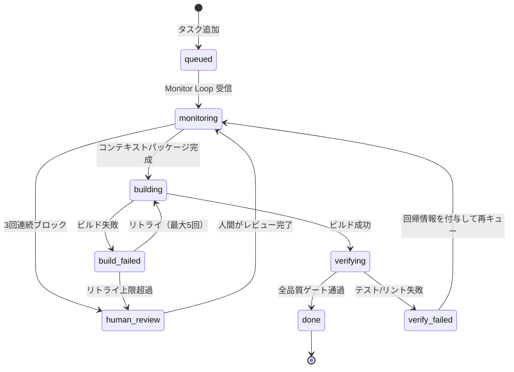
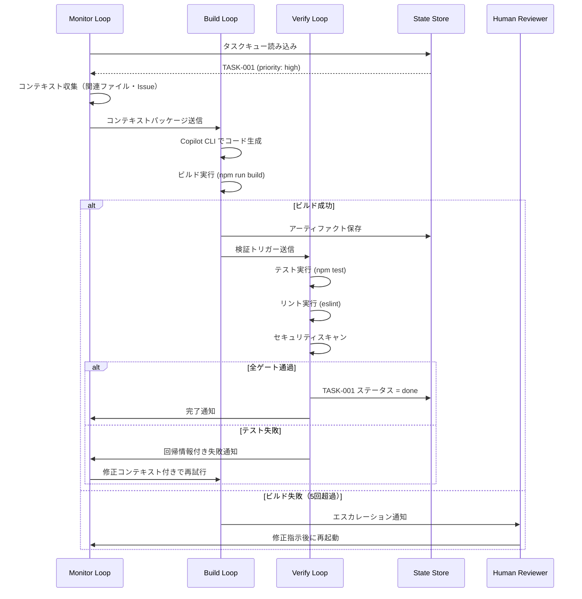

# Triple Loop Architecture

## Overview

The Triple Loop Architecture is the core design pattern for autonomous software development with Copilot CLI. It decomposes the development lifecycle into three continuously running, loosely coupled loops:

| Loop    | Responsibility                                           |
|---------|----------------------------------------------------------|
| Monitor | Observe the system, gather context, identify next tasks  |
| Build   | Generate code, run builds, resolve compilation errors    |
| Verify  | Execute tests, validate behavior, enforce quality gates  |

These loops run either sequentially (for simple pipelines) or concurrently (for high-throughput development), communicating through a shared state store and feedback bus.

---

## Why Three Loops?

Traditional CI/CD separates concerns linearly: code → build → test. This works well for human developers but breaks down for autonomous agents because:

1. **Context is expensive to gather** – agents need to repeatedly re-read the codebase; the Monitor Loop caches and maintains this context
2. **Build and test are iterative** – an autonomous agent may need 3–5 attempts to fix a failing test; having dedicated loops prevents one phase from blocking others
3. **Verification is qualitatively different from building** – verify requires external tooling (test runners, linters, security scanners) that should not be mixed with code generation

---

## Loop Interactions

```
┌────────────────────────────────────────────────────────────────┐
│                                                                │
│   ┌──────────────┐      context      ┌──────────────┐         │
│   │              │─────────────────▶ │              │         │
│   │  Monitor     │                   │   Build      │         │
│   │  Loop        │ ◀─────────────── │   Loop       │         │
│   │              │   build status    │              │         │
│   └──────┬───────┘                   └──────┬───────┘         │
│          │                                  │                 │
│          │ task plan                        │ artifacts       │
│          ▼                                  ▼                 │
│   ┌──────────────────────────────────────────────────┐        │
│   │               Shared State Store                 │        │
│   └──────────────────────────┬───────────────────────┘        │
│                              │                                │
│                              ▼                                │
│                   ┌──────────────────┐                        │
│                   │   Verify Loop    │                        │
│                   │                  │                        │
│                   └────────┬─────────┘                        │
│                            │                                  │
│                            │ results / regressions            │
│                            ▼                                  │
│                   ┌──────────────────┐                        │
│                   │  Monitor Loop    │ (re-plan if needed)    │
│                   └──────────────────┘                        │
│                                                                │
└────────────────────────────────────────────────────────────────┘
```

---

## Monitor Loop

**Purpose:** Continuously observe the repository, task backlog, and agent outputs to maintain a current picture of what needs to be done and why.

**Inputs:**
- GitHub Issues / task manifest
- Repository diff since last cycle
- Build Loop output (success/failure)
- Verify Loop output (test results, regressions)

**Outputs:**
- Updated task plan with priorities
- Context packages for the Build Loop (relevant files, related issues, design notes)
- Escalations to human reviewers when blocked

**Loop frequency:** Every 2–5 minutes in active development; every 15–30 minutes in idle/monitoring mode.

See [Monitor Loop Details](../loops/monitor-loop.md) for full documentation.

---

## Build Loop

**Purpose:** Execute code generation, compilation, and error-resolution steps until the build succeeds.

**Inputs:**
- Task definition from Monitor Loop
- Context package (relevant files, dependencies, constraints)
- Previous error output (on retry)

**Outputs:**
- Modified or created source files
- Build success/failure status
- Error logs for Monitor Loop feedback

**Loop frequency:** Triggered by Monitor Loop; runs until build passes or max retries exceeded.

See [Build Loop Details](../loops/build-loop.md) for full documentation.

---

## Verify Loop

**Purpose:** Run automated tests, static analysis, security scans, and coverage checks against Build Loop artifacts.

**Inputs:**
- Artifacts from Build Loop
- Test suite definitions
- Quality gate thresholds

**Outputs:**
- Test results (pass/fail/skip)
- Coverage report
- Security scan results
- Regression list for Monitor Loop

**Loop frequency:** Triggered after each successful Build Loop cycle.

See [Verify Loop Details](../loops/verify-loop.md) for full documentation.

---

## State Transitions

The overall system moves through the following states for each task:

```
[queued] → [monitoring] → [building] → [verifying] → [done]
                ↑               │              │
                │               ▼              ▼
                └──────── [build_failed] [verify_failed]
                                               │
                                               ▼
                                        [human_review]
```

### Mermaid 状態遷移図



### Mermaid シーケンス図（1サイクルの流れ）



### Mermaid タイムライン図（Triple Loop 8H サイクル）

```mermaid
gantt
    title Triple Loop 1サイクル（推奨: 8時間）
    dateFormat HH:mm
    axisFormat %H:%M

    section Monitor Loop
    コンテキスト収集      :monitor1, 00:00, 30m
    タスク優先度付け      :monitor2, after monitor1, 15m
    コンテキストパッケージ作成 :monitor3, after monitor2, 15m

    section Build Loop
    コード生成（Attempt 1）:build1, after monitor3, 45m
    ビルド実行・エラー修正  :build2, after build1, 30m
    コード生成（Attempt 2） :build3, after build2, 45m
    最終ビルド確認        :build4, after build3, 15m

    section Verify Loop
    テスト実行           :verify1, after build4, 30m
    リント・静的解析      :verify2, after verify1, 20m
    セキュリティスキャン  :verify3, after verify2, 20m
    カバレッジレポート    :verify4, after verify3, 15m
    PR サマリー作成      :verify5, after verify4, 15m

    section 後処理
    Monitor Loop 再開    :next, after verify5, 60m
```



---

## Configuration

The Triple Loop system is configured via a YAML manifest (`loop-config.yaml`):

```yaml
monitor:
  interval_seconds: 120
  max_context_files: 20
  escalation_threshold: 3   # escalate after 3 consecutive failures

build:
  max_retries: 5
  timeout_minutes: 15
  environment: docker        # isolated build environment

verify:
  test_command: "npm test"
  coverage_threshold: 80     # percent
  security_scan: true
  lint: true
```

---

## Related Documents

- [Monitor Loop](../loops/monitor-loop.md)
- [Build Loop](../loops/build-loop.md)
- [Verify Loop](../loops/verify-loop.md)
- [Autonomous Development Architecture](autonomous-development-architecture.md)
