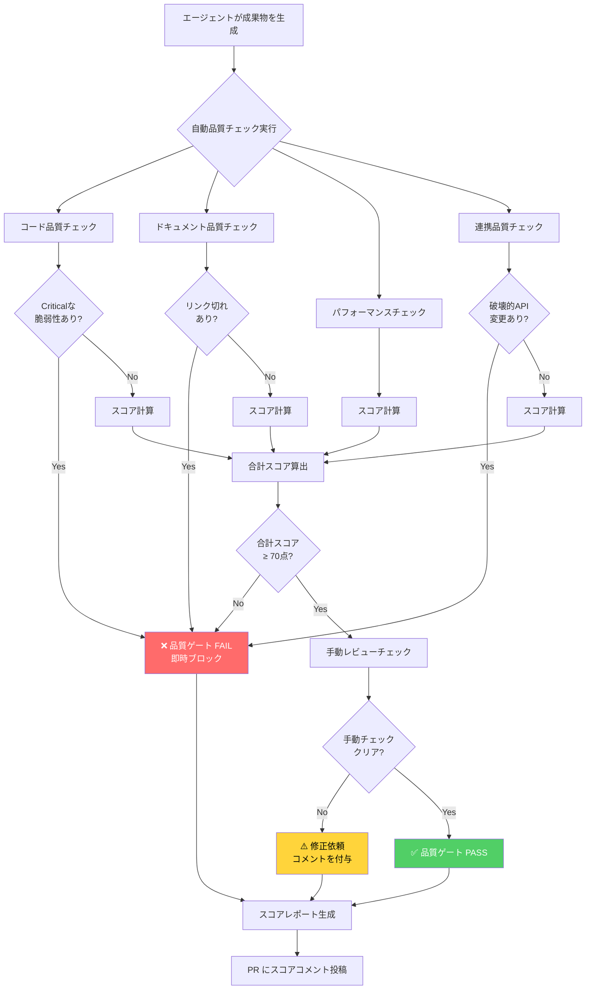

# エージェント品質評価フレームワーク（Agent Quality Framework）

## 概要

このドキュメントは、カスタムエージェント（backend-agent / test-writer / frontend-agent / security-agent / docs-agent）が生成するすべての成果物の品質を **定量的に評価するための統一フレームワーク** を定義します。

評価は「コード品質・ドキュメント品質・パフォーマンス品質・連携品質」の4カテゴリ合計 **100点満点** のスコアカードで行います。スコアをCIパイプラインに組み込み、品質ゲートとして活用することを推奨します。

### このドキュメントの対象読者

| 読者 | 用途 |
|------|------|
| 開発者 | PR レビュー時の品質判断基準として使用 |
| エージェント定義の作成者 | 各エージェントの品質期待値の設定に使用 |
| 運用担当者 | CI/CD の品質ゲート設定に使用 |
| チームリード | スプリントレビューでの品質傾向把握に使用 |

---

## 1. 評価スコアカード（100点満点）

スコアカードは4つのカテゴリに分割されます。各カテゴリのスコアは独立して計測し、最終スコアを合算します。

```
最終スコア = コード品質(40) + ドキュメント品質(30) + パフォーマンス品質(20) + 連携品質(10)
```

---

### 1-1. コード品質スコア（40点）

エージェントが出力したソースコードの静的・動的品質を評価します。

| 評価項目 | 満点 | 計測方法 |
|---------|------|---------|
| テストカバレッジ（ライン） | 15点 | `jest --coverage` / `pytest --cov` |
| テストカバレッジ（ブランチ） | 5点 | 同上 |
| セキュリティ脆弱性スキャン | 10点 | `npm audit` / `pip-audit` / Snyk |
| 可読性・静的解析（Lint） | 5点 | ESLint / flake8 / pylint |
| 型安全性チェック | 5点 | `tsc --noEmit` / mypy |

#### スコア計算の詳細

**テストカバレッジ（ライン）— 15点**

```
≥ 90%  → 15点
≥ 80%  → 12点  （推奨最低ライン）
≥ 70%  → 8点
≥ 60%  → 4点
< 60%  → 0点   （品質ゲート NG）
```

**テストカバレッジ（ブランチ）— 5点**

```
≥ 80%  → 5点
≥ 70%  → 3点
≥ 60%  → 1点
< 60%  → 0点
```

**セキュリティ脆弱性スキャン — 10点**

```
Critical 0件, High 0件    → 10点
Critical 0件, High 1〜2件 → 6点
Critical 1件以上          → 0点  （品質ゲート NG）
```

**可読性・静的解析（Lint）— 5点**

```
エラー 0件, 警告 0件  → 5点
エラー 0件, 警告 1〜5件 → 3点
エラー 1件以上         → 0点  （品質ゲート NG）
```

**型安全性チェック — 5点**

```
型エラー 0件         → 5点
型エラー 1〜3件      → 2点
型エラー 4件以上     → 0点
```

---

### 1-2. ドキュメント品質スコア（30点）

エージェントが生成・更新したドキュメントおよびコードコメントの品質を評価します。

| 評価項目 | 満点 | 計測方法 |
|---------|------|---------|
| API仕様（OpenAPI/JSDoc/docstring）完備 | 12点 | 公開関数カバレッジ計測 |
| コードコメント率（Why コメント） | 8点 | 手動レビュー |
| README/CHANGELOG 更新 | 6点 | diff チェック |
| ドキュメント内リンク有効性 | 4点 | markdown-link-check |

#### スコア計算の詳細

**API仕様完備 — 12点**

```
公開API の docstring/JSDoc カバレッジ:
100%  → 12点
≥ 80% → 9点
≥ 60% → 5点
< 60% → 0点
```

**コードコメント率（Why コメント）— 8点**

複雑なロジック（循環的複雑度 ≥ 5 の関数）に対して **Why コメント** が存在するか手動確認。

```
全複雑関数にコメントあり       → 8点
半数以上にコメントあり         → 4点
コメントほぼなし / What コメントのみ → 1点
```

**README/CHANGELOG 更新 — 6点**

```
README + CHANGELOG 両方更新    → 6点
どちらか一方のみ更新           → 3点
両方未更新                    → 0点
```

**リンク有効性 — 4点**

```
リンク切れ 0件  → 4点
リンク切れ 1件  → 2点
リンク切れ 2件以上 → 0点
```

---

### 1-3. パフォーマンス品質スコア（20点）

CI/CDパイプラインおよびランタイムにおける速度・リソース指標を評価します。

| 評価項目 | 満点 | 計測方法 |
|---------|------|---------|
| ビルド時間 | 6点 | CI ログのビルドステップ時間 |
| テスト実行時間 | 6点 | CI ログのテストステップ時間 |
| メモリ使用量（ピーク） | 4点 | ヒーププロファイリング |
| バンドルサイズ（フロントエンド） | 4点 | webpack-bundle-analyzer |

#### スコア計算の詳細

**ビルド時間 — 6点**（ベースライン比較）

```
ベースライン比 ≤ 100%（同等以下）  → 6点
ベースライン比 101〜110%           → 4点
ベースライン比 111〜130%           → 2点
ベースライン比 > 130%（30%超悪化） → 0点
```

> **ベースライン**: `main` ブランチの最新タグ時点のCI実行時間

**テスト実行時間 — 6点**

```
全テストスイート ≤ 3分      → 6点
3分超 〜 5分以内            → 4点
5分超 〜 10分以内           → 2点
10分超                     → 0点
```

**メモリ使用量（ピーク）— 4点**

```
前回比 ≤ 100%（増加なし）  → 4点
前回比 101〜115%           → 2点
前回比 > 115%（15%超増加） → 0点
```

**バンドルサイズ（フロントエンド）— 4点**

```
前回比 ≤ 100%（増加なし）  → 4点
前回比 101〜105%           → 2点
前回比 > 105%              → 0点
※ バックエンド専用タスクの場合はこの項目を満点（4点）として扱う
```

---

### 1-4. 連携品質スコア（10点）

他エージェントおよびシステム全体との協調動作を評価します。

| 評価項目 | 満点 | 評価方法 |
|---------|------|---------|
| 既存 API 後方互換性 | 4点 | 破壊的変更チェック（oasdiff 等） |
| エージェント間インターフェース整合性 | 3点 | AGENTS.md との整合性確認 |
| TASKS.md への記録・引き継ぎ情報 | 3点 | 手動確認 |

---

## 2. エージェント別推奨スコア

各エージェントの役割に合わせた最小スコア（これを下回ると品質ゲート NG）と目標スコアを定義します。

### スコア早見表

| エージェント | コード品質(40) | ドキュメント(30) | パフォーマンス(20) | 連携(10) | 合計最小 | 合計目標 |
|-------------|:-------------:|:---------------:|:-----------------:|:--------:|:-------:|:-------:|
| backend-agent | 最小32 / 目標38 | 最小22 / 目標28 | 最小14 / 目標18 | 最小7 / 目標9 | **75** | **93** |
| frontend-agent | 最小30 / 目標36 | 最小20 / 目標26 | 最小14 / 目標18 | 最小6 / 目標9 | **70** | **89** |
| test-writer | 最小36 / 目標40 | 最小18 / 目標24 | 最小12 / 目標16 | 最小7 / 目標9 | **73** | **89** |
| security-agent | 最小34 / 目標40 | 最小24 / 目標30 | 最小10 / 目標16 | 最小8 / 目標10 | **76** | **96** |
| docs-agent | 最小20 / 目標28 | 最小26 / 目標30 | 最小10 / 目標16 | 最小7 / 目標9 | **63** | **83** |

### エージェント別 重点評価ポイント

**backend-agent**
- コード品質を最優先（APIの堅牢性が最重要）
- セキュリティスキャンで Critical 脆弱性は絶対に許容しない

**frontend-agent**
- バンドルサイズとビルド時間を重視
- アクセシビリティスコアも追加指標として計測推奨（axe-core）

**test-writer**
- テストカバレッジの達成が最重要
- テスト実行時間の管理もスコアに強く影響

**security-agent**
- セキュリティスキャンと型安全性が最重要
- ドキュメント品質（脆弱性の説明記録）も高基準を維持

**docs-agent**
- ドキュメント品質が最重要カテゴリ
- リンク有効性・API仕様完備で高スコアを目指す

---

## 3. 自動チェック設定例

品質チェックを自動化するためのYAML設定例です。

### quality-gate.yaml（品質ゲート設定）

```yaml
# .github/quality-gate.yaml
# エージェント品質評価フレームワーク — 品質ゲート設定

quality_gate:
  # 品質ゲート全体の合否判定
  pass_threshold: 70          # 合計スコア70点以上で PASS
  fail_on_critical: true      # Critical脆弱性検出時は即 FAIL

  # --- コード品質 (40点) ---
  code_quality:
    coverage:
      lines_minimum: 80       # ライン カバレッジ 80% 未満で NG
      branches_minimum: 70    # ブランチ カバレッジ 70% 未満で NG
      report_format: lcov
    security:
      scanner: npm-audit      # npm-audit / pip-audit / snyk
      block_on: critical      # critical / high / medium
      auto_fix: false         # 自動修正は無効（手動確認を要求）
    lint:
      tool: eslint            # eslint / flake8 / pylint
      config: .eslintrc.json
      fail_on_error: true
      fail_on_warning: false  # 警告のみの場合は NG にしない
    typecheck:
      enabled: true
      tool: tsc               # tsc / mypy
      strict: true

  # --- ドキュメント品質 (30点) ---
  documentation:
    api_coverage:
      minimum_percent: 80     # 公開API の docstring/JSDoc カバレッジ 80% 以上
      check_tool: typedoc     # typedoc / pdoc3
    link_check:
      enabled: true
      tool: markdown-link-check
      fail_on_broken: true
    changelog_required: true  # CHANGELOG.md 更新を必須とする
    readme_check: true        # README.md の更新有無を確認

  # --- パフォーマンス品質 (20点) ---
  performance:
    build_time:
      baseline_branch: main
      max_increase_percent: 30  # ベースライン比 30% 超増加で NG
    test_time:
      max_seconds: 600          # テスト実行 10分超で NG
    memory:
      max_increase_percent: 15  # 前回比 15% 超増加で NG
    bundle_size:                # フロントエンドのみ適用
      enabled: true
      max_increase_percent: 5   # バンドルサイズ 5% 超増加で NG

  # --- 連携品質 (10点) ---
  integration:
    api_compatibility:
      enabled: true
      tool: oasdiff            # 破壊的変更チェック
      fail_on_breaking: true
    agents_md_sync: true       # AGENTS.md との整合性チェックを有効化
```

### エージェント別オーバーライド例

```yaml
# test-writer エージェント向け — カバレッジ基準を引き上げ
agent_overrides:
  test-writer:
    code_quality:
      coverage:
        lines_minimum: 90      # test-writer は 90% を要求
        branches_minimum: 80

  security-agent:
    code_quality:
      security:
        block_on: high         # security-agent は High 脆弱性でも即 FAIL

  docs-agent:
    documentation:
      api_coverage:
        minimum_percent: 100   # docs-agent は API カバレッジ 100% を要求
```

---

## 4. 手動レビューチェックリスト

自動チェックでは検出困難な品質項目を、人間がレビューする際のチェックリストです。

### 4-1. コード品質 手動確認ポイント

- [ ] **ビジネスロジックの正確性**: 仕様通りの動作か（自動テストだけでは検証できない要件）
- [ ] **エラーメッセージの品質**: ユーザーやデバッグに役立つ情報が含まれているか
- [ ] **ログの適切性**: 過剰ログ（パフォーマンス問題）・不足ログ（デバッグ不能）がないか
- [ ] **命名の一貫性**: プロジェクト全体の命名規約（AGENTS.md 記載）と一致しているか
- [ ] **デッドコードの有無**: 未使用の変数・関数・import がないか
- [ ] **マジックナンバーの排除**: 定数に意味のある名前が付与されているか
- [ ] **テストの有意性**: テストが実際にバグを検出できる内容か（常に PASS するだけのテストでないか）

### 4-2. ドキュメント品質 手動確認ポイント

- [ ] **Why コメントの存在**: 複雑なロジックに「なぜそうするか」の説明があるか
- [ ] **API仕様の正確性**: 実装とドキュメントが乖離していないか（コードが正しい場合でもドキュメントが古い場合がある）
- [ ] **サンプルコードの動作確認**: README の quickstart が実際に動作するか
- [ ] **TODO コメントの管理**: `TODO(担当者): 説明 [Issue#番号]` 形式になっているか
- [ ] **CHANGELOG の可読性**: エンドユーザー目線でリリース内容が理解できるか

### 4-3. パフォーマンス品質 手動確認ポイント

- [ ] **N+1 クエリの有無**: ループ内での DB クエリ発行がないか
- [ ] **キャッシュ戦略**: 頻繁にアクセスされるデータにキャッシュが設定されているか
- [ ] **非同期処理の最適化**: Promise.all / asyncio.gather で並列化できる箇所がないか
- [ ] **インデックスの確認**: DB クエリで使用されるカラムにインデックスが存在するか

### 4-4. 連携品質 手動確認ポイント

- [ ] **AGENTS.md との整合性**: 実装方針が AGENTS.md に記載の設計原則と矛盾しないか
- [ ] **引き継ぎ情報の記録**: 次のエージェントが作業を引き継ぐための情報が TASKS.md に記載されているか
- [ ] **インターフェース変更の通知**: 他エージェントが依存する API を変更した場合、影響範囲が明記されているか
- [ ] **環境依存の排除**: ローカル環境固有の設定がコミットに含まれていないか

---

## 5. スコア改善のベストプラクティス

スコアが低い場合のカテゴリ別改善アプローチを示します。

### 5-1. コード品質スコアが低い場合

**カバレッジ不足（< 80%）**

```
1. カバレッジレポートを開いて「未テスト行（赤）」を特定する
   → jest --coverage && open coverage/lcov-report/index.html

2. 未テスト箇所の優先順位付け:
   優先度高: ビジネスロジック / エラーハンドリング
   優先度低: ゲッター / シンプルなユーティリティ関数

3. test-writer エージェントに以下を指示:
   「src/[対象ファイル] のカバレッジが [X]% です。
    特に [未テスト関数名] のテストを追加してください。
    異常系・境界値テストを重点的に」
```

**セキュリティ脆弱性**

```
1. npm audit --json で脆弱性詳細を確認する
2. 依存関係ツリーを確認: npm ls [パッケージ名]
3. 修正方針:
   Critical/High → 即時アップデートまたは代替パッケージへ移行
   Medium        → 次スプリントで対処
   Low           → バックログに記録

4. security-agent に以下を指示:
   「[パッケージ名] の [CVE番号] に対応してください。
    影響範囲: [ファイル一覧]」
```

**Lint エラー**

```
# 自動修正可能なエラーを修正
npx eslint --fix src/
# または
npx prettier --write src/

# 修正後に再確認
npx eslint src/
```

### 5-2. ドキュメント品質スコアが低い場合

**API仕様カバレッジ不足**

```
1. 公開関数のリストアップ:
   grep -r "export " src/ | grep -v test | grep -v ".d.ts"

2. docstring/JSDoc なしの関数を特定:
   typedoc --validation

3. docs-agent に以下を指示:
   「src/[ファイル名] の公開関数に JSDoc コメントを追加してください。
    @param, @returns, @throws を含め、使用例も記載してください」
```

**CHANGELOG 未更新**

```
CHANGELOG.md の更新テンプレート:

## [未リリース]
### Added
- 追加した機能の説明（ユーザー視点で）

### Changed
- 変更内容（後方互換性のない変更は明記）

### Fixed
- 修正したバグの説明

### Security
- セキュリティ修正の概要（CVE番号があれば記載）
```

### 5-3. パフォーマンス品質スコアが低い場合

**ビルド時間の改善**

```yaml
# webpack.config.js — キャッシュ有効化
module.exports = {
  cache: {
    type: 'filesystem',
    buildDependencies: { config: [__filename] }
  }
}
```

**テスト実行時間の改善**

```bash
# 並列実行数を増やす（Jest）
jest --maxWorkers=4

# 遅いテストを特定する
jest --verbose --testNamePattern=""  # 全テストの実行時間を表示

# テストの並列化（pytest）
pytest -n auto  # pytest-xdist 使用
```

### 5-4. 連携品質スコアが低い場合

**AGENTS.md との整合性問題**

```
1. AGENTS.md を最新の状態に更新する:
   - 設計判断の変更理由を記録する
   - 非推奨のパターンを明記する

2. タスク記述に参照を追加:
   「AGENTS.md のアーキテクチャ原則に従って実装してください」

3. 実装後のセルフチェック:
   - 命名規約は一致しているか
   - エラーハンドリングの形式は統一されているか
```

---

## 6. 評価ワークフロー

品質チェックのフロー全体を可視化します。



---

## 7. CI/CDへの統合方法

GitHub Actions を使った自動品質チェックの実装例です。

### ワークフロー全体構成

```yaml
# .github/workflows/agent-quality-check.yml
name: Agent Quality Check

on:
  pull_request:
    branches: [main, develop]
  push:
    branches: [main]

jobs:
  quality-gate:
    name: 品質ゲート評価
    runs-on: ubuntu-latest
    outputs:
      total-score: ${{ steps.score.outputs.total }}
      gate-result: ${{ steps.gate.outputs.result }}

    steps:
      - uses: actions/checkout@v4
        with:
          fetch-depth: 0  # 差分比較のため全履歴を取得

      # ===== コード品質チェック =====
      - name: Setup Node.js
        uses: actions/setup-node@v4
        with:
          node-version: '20'
          cache: 'npm'

      - name: Install dependencies
        run: npm ci

      - name: Run ESLint
        id: lint
        run: |
          npx eslint src/ --format json --output-file lint-report.json || true
          ERROR_COUNT=$(cat lint-report.json | jq '[.[].errorCount] | add // 0')
          WARNING_COUNT=$(cat lint-report.json | jq '[.[].warningCount] | add // 0')
          echo "errors=$ERROR_COUNT" >> $GITHUB_OUTPUT
          echo "warnings=$WARNING_COUNT" >> $GITHUB_OUTPUT

      - name: Run TypeScript type check
        id: typecheck
        run: |
          npx tsc --noEmit 2>&1 | tee tsc-output.txt || true
          ERROR_COUNT=$(grep -c "error TS" tsc-output.txt || echo 0)
          echo "errors=$ERROR_COUNT" >> $GITHUB_OUTPUT

      - name: Run tests with coverage
        id: coverage
        run: |
          npm test -- --coverage --coverageReporters=json-summary --forceExit || true
          LINE_PCT=$(cat coverage/coverage-summary.json | jq '.total.lines.pct')
          BRANCH_PCT=$(cat coverage/coverage-summary.json | jq '.total.branches.pct')
          echo "lines=$LINE_PCT" >> $GITHUB_OUTPUT
          echo "branches=$BRANCH_PCT" >> $GITHUB_OUTPUT

      - name: Security scan
        id: security
        run: |
          npm audit --json > audit-report.json || true
          CRITICAL=$(cat audit-report.json | jq '.metadata.vulnerabilities.critical // 0')
          HIGH=$(cat audit-report.json | jq '.metadata.vulnerabilities.high // 0')
          echo "critical=$CRITICAL" >> $GITHUB_OUTPUT
          echo "high=$HIGH" >> $GITHUB_OUTPUT

      # ===== ドキュメント品質チェック =====
      - name: Check markdown links
        id: links
        run: |
          npx markdown-link-check **/*.md --config .mlc-config.json 2>&1 | tee link-report.txt || true
          BROKEN=$(grep -c "\[✖\]" link-report.txt || echo 0)
          echo "broken=$BROKEN" >> $GITHUB_OUTPUT

      - name: Check CHANGELOG update
        id: changelog
        run: |
          UPDATED=$(git diff --name-only origin/main...HEAD | grep -c "CHANGELOG.md" || echo 0)
          echo "updated=$UPDATED" >> $GITHUB_OUTPUT

      # ===== パフォーマンスチェック =====
      - name: Measure test execution time
        id: test-time
        run: |
          START=$(date +%s)
          npm test --forceExit 2>/dev/null || true
          END=$(date +%s)
          DURATION=$((END - START))
          echo "seconds=$DURATION" >> $GITHUB_OUTPUT

      # ===== スコア計算 =====
      - name: Calculate quality score
        id: score
        run: |
          python3 .github/scripts/calculate-quality-score.py \
            --lint-errors "${{ steps.lint.outputs.errors }}" \
            --lint-warnings "${{ steps.lint.outputs.warnings }}" \
            --type-errors "${{ steps.typecheck.outputs.errors }}" \
            --coverage-lines "${{ steps.coverage.outputs.lines }}" \
            --coverage-branches "${{ steps.coverage.outputs.branches }}" \
            --security-critical "${{ steps.security.outputs.critical }}" \
            --security-high "${{ steps.security.outputs.high }}" \
            --broken-links "${{ steps.links.outputs.broken }}" \
            --changelog-updated "${{ steps.changelog.outputs.updated }}" \
            --test-seconds "${{ steps.test-time.outputs.seconds }}" \
            --output-file quality-report.json
          TOTAL=$(cat quality-report.json | jq '.total_score')
          echo "total=$TOTAL" >> $GITHUB_OUTPUT

      # ===== 品質ゲート判定 =====
      - name: Quality gate decision
        id: gate
        run: |
          TOTAL=${{ steps.score.outputs.total }}
          CRITICAL=${{ steps.security.outputs.critical }}
          BROKEN=${{ steps.links.outputs.broken }}

          if [ "$CRITICAL" -gt 0 ] || [ "$BROKEN" -gt 0 ]; then
            echo "result=FAIL" >> $GITHUB_OUTPUT
            echo "reason=Critical vulnerability or broken links detected" >> $GITHUB_OUTPUT
          elif [ "$TOTAL" -lt 70 ]; then
            echo "result=FAIL" >> $GITHUB_OUTPUT
            echo "reason=Total score $TOTAL < 70 (minimum threshold)" >> $GITHUB_OUTPUT
          else
            echo "result=PASS" >> $GITHUB_OUTPUT
            echo "reason=All quality gates passed (score: $TOTAL)" >> $GITHUB_OUTPUT
          fi

      # ===== PR へのレポートコメント =====
      - name: Post quality report to PR
        if: github.event_name == 'pull_request'
        uses: actions/github-script@v7
        with:
          script: |
            const fs = require('fs');
            const report = JSON.parse(fs.readFileSync('quality-report.json', 'utf8'));
            const result = '${{ steps.gate.outputs.result }}';
            const emoji = result === 'PASS' ? '✅' : '❌';

            const body = `## ${emoji} エージェント品質評価レポート

            **合計スコア: ${report.total_score}/100 点** — ${result}

            | カテゴリ | スコア | 満点 | 状態 |
            |---------|------:|-----:|:----:|
            | コード品質 | ${report.code_score} | 40 | ${report.code_score >= 32 ? '✅' : '⚠️'} |
            | ドキュメント品質 | ${report.doc_score} | 30 | ${report.doc_score >= 18 ? '✅' : '⚠️'} |
            | パフォーマンス品質 | ${report.perf_score} | 20 | ${report.perf_score >= 12 ? '✅' : '⚠️'} |
            | 連携品質 | ${report.integration_score} | 10 | ${report.integration_score >= 6 ? '✅' : '⚠️'} |

            > 詳細: \`quality-report.json\` を確認してください
            `;

            github.rest.issues.createComment({
              issue_number: context.issue.number,
              owner: context.repo.owner,
              repo: context.repo.repo,
              body
            });

      - name: Fail if quality gate not passed
        if: steps.gate.outputs.result == 'FAIL'
        run: |
          echo "❌ 品質ゲート FAIL: ${{ steps.gate.outputs.reason }}"
          exit 1
```

### スコア計算スクリプト

```python
# .github/scripts/calculate-quality-score.py
"""
エージェント品質評価フレームワーク — スコア計算スクリプト
agent-quality-framework.md の定義に基づいてスコアを計算します
"""
import argparse
import json


def calc_coverage_lines(pct: float) -> int:
    if pct >= 90: return 15
    if pct >= 80: return 12
    if pct >= 70: return 8
    if pct >= 60: return 4
    return 0


def calc_coverage_branches(pct: float) -> int:
    if pct >= 80: return 5
    if pct >= 70: return 3
    if pct >= 60: return 1
    return 0


def calc_security(critical: int, high: int) -> int:
    if critical > 0: return 0
    if high <= 2: return 6
    return 10 if high == 0 else 6


def calc_lint(errors: int, warnings: int) -> int:
    if errors > 0: return 0
    if warnings <= 5: return 3
    return 5 if warnings == 0 else 3


def calc_typecheck(errors: int) -> int:
    if errors == 0: return 5
    if errors <= 3: return 2
    return 0


def calc_doc_links(broken: int) -> int:
    if broken == 0: return 4
    if broken == 1: return 2
    return 0


def calc_changelog(updated: int) -> int:
    return 6 if updated > 0 else 0


def calc_test_time(seconds: int) -> int:
    if seconds <= 180: return 6
    if seconds <= 300: return 4
    if seconds <= 600: return 2
    return 0


def main():
    parser = argparse.ArgumentParser()
    parser.add_argument('--lint-errors', type=int, default=0)
    parser.add_argument('--lint-warnings', type=int, default=0)
    parser.add_argument('--type-errors', type=int, default=0)
    parser.add_argument('--coverage-lines', type=float, default=0)
    parser.add_argument('--coverage-branches', type=float, default=0)
    parser.add_argument('--security-critical', type=int, default=0)
    parser.add_argument('--security-high', type=int, default=0)
    parser.add_argument('--broken-links', type=int, default=0)
    parser.add_argument('--changelog-updated', type=int, default=0)
    parser.add_argument('--test-seconds', type=int, default=0)
    parser.add_argument('--output-file', default='quality-report.json')
    args = parser.parse_args()

    code_score = (
        calc_coverage_lines(args.coverage_lines) +
        calc_coverage_branches(args.coverage_branches) +
        calc_security(args.security_critical, args.security_high) +
        calc_lint(args.lint_errors, args.lint_warnings) +
        calc_typecheck(args.type_errors)
    )
    doc_score = (
        calc_doc_links(args.broken_links) +
        calc_changelog(args.changelog_updated)
        # ※ API仕様カバレッジ・コメント率は手動評価のため省略
    )
    perf_score = calc_test_time(args.test_seconds)
    integration_score = 7  # 連携品質は手動レビューが主体のため固定値

    total = code_score + doc_score + perf_score + integration_score

    report = {
        "total_score": total,
        "code_score": code_score,
        "doc_score": doc_score,
        "perf_score": perf_score,
        "integration_score": integration_score,
    }

    with open(args.output_file, 'w') as f:
        json.dump(report, f, indent=2, ensure_ascii=False)

    print(f"合計スコア: {total}/100")


if __name__ == '__main__':
    main()
```

---

## 関連ドキュメント

- [自律開発セッションのベストプラクティス](./autonomous-session-best-practices.md)
- [エージェント定義一覧](../.github/agents/)
- [Triple Loop アーキテクチャ](../architecture/triple-loop-architecture.md)
- [運用ガイド](../operations/)
