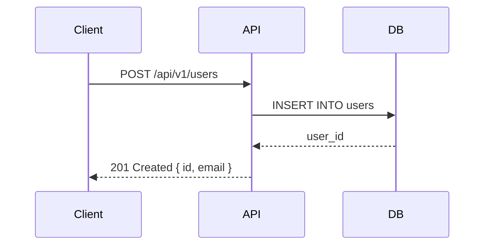

# 08 ドキュメント生成（Doc Generation）

## 概要

コードベースから README・API リファレンス・アーキテクチャ図・コードコメントを
自動生成・整備します。

---

## Claude Code 起動コマンド

```bash
claude --dangerously-skip-permissions
```

---

## プロンプト指示

```
以下のコードベースのドキュメントを生成・整備してください。

【対象】
- ドキュメント対象: [FILE_PATH or MODULE or 全体]
- 読者: [開発者 / 運用担当 / ステークホルダー / 外部コントリビューター]
- 生成するドキュメント種別:
  - [ ] README.md（プロジェクト概要・セットアップ・使い方）
  - [ ] API リファレンス（OpenAPI 3.0 / JSDoc / TypeDoc）
  - [ ] アーキテクチャ図（Mermaid: シーケンス図・クラス図・ER 図）
  - [ ] コードコメント（JSDoc / docstring の不足箇所を補完）
  - [ ] CONTRIBUTING.md（コントリビューター向けガイド）
  - [ ] CHANGELOG.md（git log から変更履歴を生成）
  - [ ] ADR（Architecture Decision Records）

【品質基準】
- README はセットアップ手順を実行するだけで動く状態にする
  （コマンドを順番に実行すれば動作確認できること）
- API ドキュメントはパラメータ・レスポンス・エラーをすべて記載する
- Mermaid 図は実際のコードから自動生成する（手書き禁止）

【実行してほしいこと】
1. コードを解析してドキュメントに必要な情報を抽出する
2. 「読者」に合わせたトーン・詳細レベルでドキュメントを生成する
3. 各ドキュメントを生成する
4. Mermaid でシーケンス図・クラス図・ER 図を生成する
5. docs/ ディレクトリに整理して配置する
   docs/
   ├── README.md         ← プロジェクトルートにもコピー
   ├── api/              ← API リファレンス
   ├── architecture/     ← アーキテクチャ図・ADR
   └── guides/           ← 開発・運用ガイド
6. README からすべてのドキュメントへリンクを張る
7. git commit（docs: ドキュメントを整備）する
```

---

## 使用場面

| シナリオ | 説明 |
|---------|------|
| OSS 公開前のドキュメント整備 | README・CONTRIBUTING・API リファレンス |
| 新メンバーのオンボーディング資料 | セットアップ手順・アーキテクチャ解説 |
| API 仕様書の自動生成 | OpenAPI / Swagger の生成 |
| ADR（意思決定記録）の作成 | 設計判断の記録・ナレッジ継承 |

---

## ドキュメント生成ツール

```bash
# TypeScript: TypeDoc で API ドキュメント生成
npx typedoc src/ --out docs/api

# Python: pdoc でドキュメント生成
pdoc src/ --output-dir docs/api

# OpenAPI: コードから自動生成（Fastify + zod）
npx fastify-zod-openapi > openapi.yaml

# Mermaid 図のプレビュー（VS Code 拡張）
code --install-extension bierner.markdown-mermaid

# CHANGELOG 自動生成
npx git-cliff --output CHANGELOG.md
```

---

## Mermaid 図の例



---

## README テンプレート構成

```markdown
# プロジェクト名

> 一文でサービスの説明

## 特徴
## クイックスタート（5分で動かせる手順）
## ドキュメント（リンク集）
## アーキテクチャ（Mermaid 図）
## 開発環境のセットアップ
## テストの実行
## デプロイ
## コントリビューション
## ライセンス
```

---

## ポイント

- Mermaid 図を活用することで保守しやすいドキュメントになる（コードと同期しやすい）
- 「読者を指定する」ことで適切な詳細レベルのドキュメントが生成される
- Triple Loop の docs Agent がドキュメントの鮮度を自動維持する
