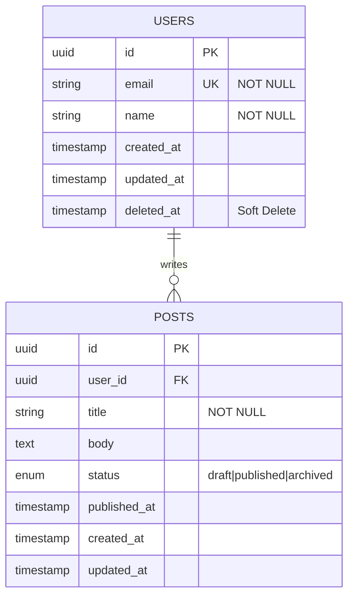

# 12 データベース設計（Database Design）

## 概要

ER 図（Mermaid）での設計・レビューから、マイグレーション・シードデータ・
インデックス設計まで一括実施。第3正規形を基本に設計します。

---

## Claude Code 起動コマンド

```bash
claude --dangerously-skip-permissions
```

---

## プロンプト指示

```
以下の要件でデータベーススキーマを設計・実装してください。

【要件】
- DB エンジン: [PostgreSQL 16 / MySQL 8 / SQLite / MongoDB]
- ORM: [Prisma / TypeORM / SQLAlchemy / GORM / Drizzle]
- サービス概要: [どんなサービスか（1〜2文）]
- 主要エンティティ: [ユーザー / 商品 / 注文 / 記事 / など]
- データ規模（予測）: [MAU: xx 万人、レコード数: xx 万件/テーブル]

【設計要件（Architect / DevAPI Agent が担当）】
- 正規化（第3正規形を基本とする）
- インデックス設計（クエリパターンに基づく）
- 外部キー制約・ユニーク制約の設定
- Soft Delete の採用可否を検討する
- 監査ログ（created_at / updated_at / deleted_at）を全テーブルに追加する
- マルチテナント対応が必要か検討する（tenant_id カラム）
- UUID vs 連番 ID の採用方針を決定する

【実行してほしいこと】
1. ER 図（Mermaid erDiagram）でスキーマ設計を提示して承認を得る
2. マイグレーションファイルを生成する
3. シードデータ（開発・テスト用）を作成する
4. 主要クエリパターンのインデックスを設定する
5. EXPLAIN ANALYZE でクエリプランを確認する
   - インデックスが効いているか確認する
   - N+1 が発生しないクエリ例を提示する
6. スキーマ設計の意思決定を docs/database.md に記載する（ADR 形式）
7. git commit（feat: データベーススキーマの初期設計）する

【完了基準】
- マイグレーションが正常に適用される
- シードデータが正常に投入される
- 主要クエリが適切なインデックスを使用している（Seq Scan なし）
```

---

## 使用場面

| シナリオ | 説明 |
|---------|------|
| 新規サービスの DB 設計 | 0 からのスキーマ設計 |
| 既存 DB のリファクタリング | 正規化・パフォーマンス改善 |
| インデックス追加 | スロークエリの解消 |
| マルチテナント対応 | テナント分離戦略の実装 |

---

## ER 図テンプレート（Mermaid）



---

## インデックス設計ガイドライン

```sql
-- よく使うクエリパターンに合わせてインデックスを設計
-- 例: メールアドレスでのログイン
CREATE UNIQUE INDEX idx_users_email ON users(email);

-- 例: ユーザーの投稿一覧（時系列）
CREATE INDEX idx_posts_user_published ON posts(user_id, published_at DESC)
  WHERE deleted_at IS NULL;

-- インデックスの効果確認
EXPLAIN ANALYZE
SELECT * FROM posts
WHERE user_id = '...' AND deleted_at IS NULL
ORDER BY published_at DESC LIMIT 20;
```

---

## スキーマ設計の意思決定テンプレート（ADR）

```markdown
## DB 設計決定: UUID vs 連番 ID

**決定**: UUID v7 を採用する

**理由**:
- 分散環境でのユニーク性保証
- ID の予測不可能性（セキュリティ）
- タイムスタンプ順でソート可能（v7）

**トレードオフ**:
- 連番より若干インデックスサイズが大きい
- 可読性が低い（デバッグ時に不便）
```

---

## ポイント

- Mermaid ER 図で承認を得てから実装することでやり直しを防ぐ
- `EXPLAIN ANALYZE` は実際のデータ量でテストする（小さいデータでは意味がない）
- Soft Delete の採用は「削除データの参照が必要か」で判断する
- Triple Loop の Monitor Loop がスロークエリを継続監視する
